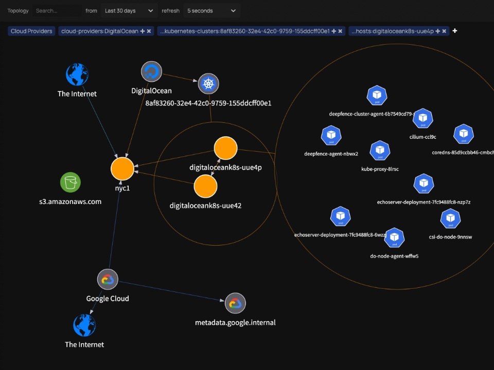
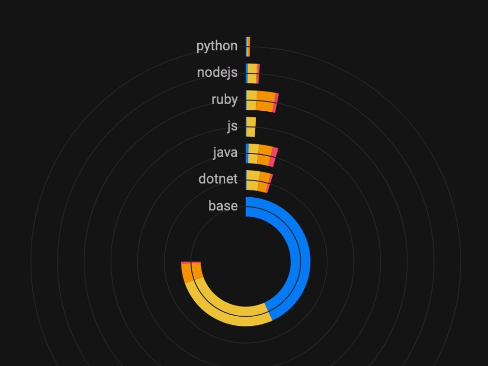
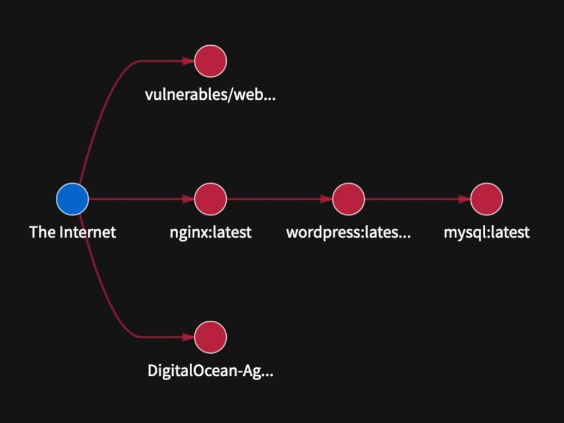

[](https://github.com/deepfence/ThreatMapper/blob/master/LICENSE)
[](https://github.com/deepfence/ThreatMapper/stargazers)
[](https://github.com/deepfence/ThreatMapper/issues)
[](https://github.com/deepfence/ThreatMapper/wiki)
[](https://github.com/deepfence/ThreatMapper/wiki/ThreatMapper-Demo)
[](https://hub.docker.com/r/deepfenceio/deepfence_agent_ce)
[](https://join.slack.com/t/deepfence-community/shared_invite/zt-podmzle9-5X~qYx8wMaLt9bGWwkSdgQ)
[](https://twitter.com/intent/tweet?text=Wow:&url=https%3A%2F%2Fgithub.com%2Fdeepfence%2FThreatMapper)

###
### CVE-2021-44228 Log4J Vulnerability can be detected at runtime and attack paths can be visualized by ThreatMapper.
- Live demo of Log4J Vulnerability [here](https://github.com/deepfence/ThreatMapper/wiki/ThreatMapper-Demo)
- More details [here](https://deepfence.io/cve-2021-44228-log4j2-exploitability-and-attack-path-mitigation-with-threatmapper/)

# ThreatMapper - Runtime Vulnerability Management and Attack Path Enumeration for Cloud Native

Deepfence ThreatMapper hunts for vulnerabilities in your production platforms, and ranks these vulnerabilities based on their risk-of-exploit. You can then prioritize the issues that present the greatest risk to the security of your applications - [read more](https://github.com/deepfence/ThreatMapper/wiki/Introduction).

<table width="100%">
  <tr>
  <td align="center" valign="top" width="33%"><a href="../../raw/master/images/readme/threatmapper-topology-full.jpg"></a>
    <br/><br/>
    Learn the Topology
  </td>
  <td align="center" valign="top" width="33%"><a href="../../raw/master/images/readme/threatmapper-vulnerabilities-full.jpg"></a>
    <br/><br/>
    Identify Vulner&shy;abilities
  </td>
  <td align="center" valign="top" width="33%"><a href="../../raw/master/images/readme/threatmapper-exploits-full.jpg"></a>
    <br/><br/>
    Discover Attack Paths
  </td>
  </tr>
</table>

[See ThreatMapper running with a live demo.](https://github.com/deepfence/ThreatMapper/wiki/ThreatMapper-Demo)

# Getting Started with ThreatMapper

https://user-images.githubusercontent.com/1436408/144302426-733a062c-5f56-4404-9c37-547452a6b75b.mp4

## Planning your Deployment

The ThreatMapper console can be deployed on a single docker host or in a Kubernetes cluster.

ThreatMapper then monitors your development or production workloads using Sensor Agents.  The sensors can be deployed on a wide range of platforms - Kubernetes, Docker, Fargate, Bare-Metal and Virtual Machines.  Check the [prerequisites](https://github.com/deepfence/ThreatMapper/wiki/Installation-Requirements) before you proceed.

## Install the Management Console

Installing the management console on a Docker host (4 cores, 16Gb) is as straightforward as:

```shell script
wget https://github.com/deepfence/ThreatMapper/raw/master/deployment-scripts/docker-compose.yml
docker-compose -f docker-compose.yml up --detach
```

Once `docker-compose` has detached, allow 30 seconds or so for the console to complete its startup.  Note that the console uses an untrusted self-signed TLS key by default ([how to fix](https://github.com/deepfence/ThreatMapper/wiki/Console-Initial-Configuration#using-your-own-tls-certificates---docker)).

Installation on Kubernetes is performed with a [Helm Chart](https://github.com/deepfence/ThreatMapper/wiki/Installing-the-Management-Console#install-the-threatmapper-management-console---kubernetes-cluster):

```shell script
# Install OpenEBS, and wait for it to start up
kubectl create ns openebs
helm install openebs --namespace openebs --repo "https://openebs.github.io/charts" openebs --set analytics.enabled=false
kubectl get pods -o wide --namespace openebs -w

# Install the Kubernetes metrics service (if not already installed)
kubectl apply -f https://github.com/kubernetes-sigs/metrics-server/releases/download/v0.5.0/components.yaml

# Configure the Deepfence ThreatMapper Helm Chart
helm repo add deepfence https://deepfence-helm-charts.s3.amazonaws.com/threatmapper

# Install the ThreatMapper console and wait for the pods to start up
helm install deepfence-console deepfence/deepfence-console
kubectl get pods -o wide -w

# Optionally, install the Deepfence Router service and wait for the platform to deploy a load balancer
helm install deepfence-router deepfence/deepfence-router
kubectl get --namespace default svc -w deepfence-router
```

More details are in the [ThreatMapper documentation](https://github.com/deepfence/ThreatMapper/wiki/Installing-the-Management-Console#install-the-threatmapper-management-console---kubernetes-cluster).

### Initial Configuration

Once the Management Console is up and running, you can [register an admin account and obtain an API key](https://github.com/deepfence/ThreatMapper/wiki/Console-Initial-Configuration).  

When the console first starts up, it will begin to acquire the Threat Intel feed data; this usually takes a few minutes, but can take up to an hour.  You can install sensors and browse the topology of your applications, but you will not be able to perform vulnerability scans until the threat feeds have been fully acquired.

## Install the ThreatMapper Sensor Agents

Install the Sensor Agents on your production or development platforms. The Sensor Agents report to the Management Console; they tell it what services they discover, provide telemetry and generate manifests of software dependencies.

The following production platforms are supported by ThreatMapper sensors:

 * [Amazon ECS](https://github.com/deepfence/ThreatMapper/wiki/Installing-Sensors-in-Amazon-ECS): ThreatMapper sensors are deployed as a daemon service using a task definition.
 * [AWS Fargate](https://github.com/deepfence/ThreatMapper/wiki/Installing-Sensors-in-Amazon-Fargate): ThreatMapper sensors are deployed as a sidecar container, using a task definition.
 * [Google Kubernetes Engine](https://github.com/deepfence/ThreatMapper/wiki/Installing-Sensors-in-Google-Kubernetes-Engine): ThreatMapper sensors are deployed as a daemonset in the GKE cluster.
 * [Azure Kubernetes Service](https://github.com/deepfence/ThreatMapper/wiki/Installing-Sensors-in-Azure-Kubernetes-Service): ThreatMapper sensors are deployed as a daemonset in the AKS cluster.
 * [Kubernetes](https://github.com/deepfence/ThreatMapper/wiki/Installing-Sensors-in-Kubernetes): ThreatMapper sensors are deployed as a daemonset in the Kubernetes cluster, using a helm chart.
 * [Docker](https://github.com/deepfence/ThreatMapper/wiki/Installing-Sensors-in-Docker): ThreatMapper sensors are deployed as a lightweight container.
 * [Bare-Metal or Virtual Machines](https://github.com/deepfence/ThreatMapper/wiki/Installing-Sensors-in-Bare-OS): ThreatMapper sensors are deployed within a lightweight Docker runtime.

For example, run the following command to start the Deepfence Sensor on the Docker host:

```shell script
docker run -dit --cpus=".2" --name=deepfence-agent --restart on-failure --pid=host --net=host \
  --privileged=true -v /sys/kernel/debug:/sys/kernel/debug:rw -v /var/log/fenced \
  -v /var/run/docker.sock:/var/run/docker.sock -v /:/fenced/mnt/host/:ro \
  -e USER_DEFINED_TAGS="" -e MGMT_CONSOLE_URL="---CONSOLE-IP---" -e MGMT_CONSOLE_PORT="443" \
  -e DEEPFENCE_KEY="---DEEPFENCE-API-KEY---" \
  deepfenceio/deepfence_agent_ce:latest
```

On a Kubernetes platform, the sensors are installed using a Helm chart:

```shell script
helm repo add deepfence https://deepfence-helm-charts.s3.amazonaws.com/threatmapper

# helm v2
helm install deepfence/deepfence-agent \
    --name=deepfence-agent \
    --set managementConsoleUrl=---CONSOLE-IP--- \
    --set deepfenceKey=---DEEPFENCE-API-KEY---

# helm v3
helm install deepfence-agent deepfence/deepfence-agent \
    --set managementConsoleUrl=---CONSOLE-IP--- \
    --set deepfenceKey=---DEEPFENCE-API-KEY---
```

## Next Steps

Once the sensor agents have been installed, you can begin to explore the topology of your infrastructure and applications.

Subsequently, when the threat feeds have been acquired, you'll see a message on **Settings** -> **Diagnosis**. You can begin with your first [Production Vulnerability Scan](https://github.com/deepfence/ThreatMapper/wiki/Scanning-Production-Deployments).

Check out the [Deepfence ThreatMapper wiki](https://github.com/deepfence/ThreatMapper/wiki) for how to get started with using Deepfence ThreatMapper.


# Get in touch

* [](https://join.slack.com/t/deepfence-community/shared_invite/zt-podmzle9-5X~qYx8wMaLt9bGWwkSdgQ) Got a question, need some help?  Find the Deepfence team on Slack
* https://github.com/deepfence/ThreatMapper/issues: Got a feature request or found a bug?  Raise an issue
* productsecurity at deepfence dot io: Found a security issue?  Share it in confidence
* Read the documentation in the [Deepfence ThreatMapper wiki](https://github.com/deepfence/ThreatMapper/wiki)
* Find out more at [deepfence.io](https://deepfence.io/)


# Security and Support

For any security-related issues in the ThreatMapper project, contact **productsecurity *at* deepfence *dot* io**.

Please file GitHub issues as needed, and join the Deepfence Community [Slack channel](https://join.slack.com/t/deepfence-community/shared_invite/zt-podmzle9-5X~qYx8wMaLt9bGWwkSdgQ).

# License

The Deepfence ThreatMapper project (this repository) is offered under the [Apache2 license](https://www.apache.org/licenses/LICENSE-2.0).

Contributions to Deepfence ThreatMapper project are similarly accepted under the Apache2 license, as per [GitHub's inbound=outbound policy](https://docs.github.com/en/github/site-policy/github-terms-of-service#6-contributions-under-repository-license).
