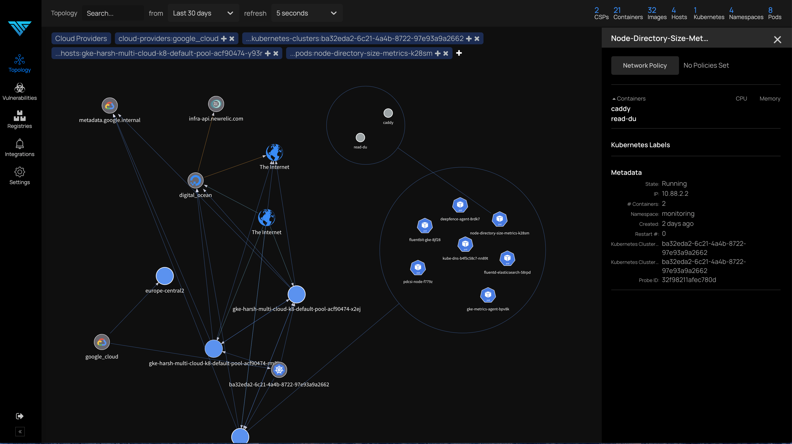
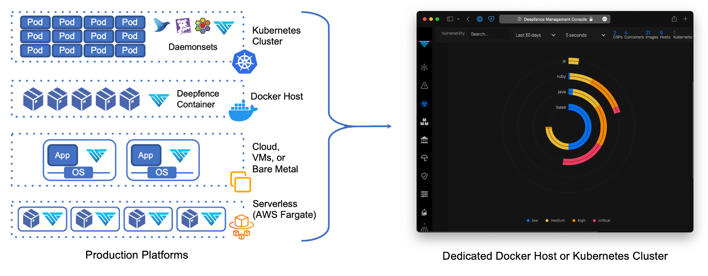

[](https://github.com/deepfence/ThreatMapper/blob/master/LICENSE)
[](https://github.com/deepfence/ThreatMapper/stargazers)
[](https://github.com/deepfence/ThreatMapper/issues)
[](https://github.com/deepfence/ThreatMapper/wiki)
[](https://github.com/deepfence/ThreatMapper/wiki/ThreatMapper-Demo)
[](https://join.slack.com/t/deepfence-community/shared_invite/zt-podmzle9-5X~qYx8wMaLt9bGWwkSdgQ)
[](https://twitter.com/intent/tweet?text=Wow:&url=https%3A%2F%2Fgithub.com%2Fdeepfence%2FThreatMapper)

# Deepfence ThreatMapper

Deepfence ThreatMapper helps you to monitor and secure your running applications, in Cloud, Kubernetes, Docker, and Fargate Serverless.

Your 'Shift Left' initiatives enable you to deliver secure applications; ThreatMapper picks up where 'Shift Left' ends:

* **Discover Running Workloads:** ThreatMapper scans your platforms and identifies pods, containers, applications, and infrastructure.  Use ThreatMapper to discover the topology of your applications and attack surface.
* **Discover Vulnerabilities:** ThreatMapper obtains manifests of dependencies from running pods and containers, serverless apps, applications, and operating system.  ThreatMapper matches these against vulnerability feeds to identify vulnerable components.
* **Rank Vulnerabilities by Risk-of-Exploit:** ThreatMapper ranks discovered vulnerabilities against CVSS and other severity scores, exploit method and proximity to attack surface, in order to identify which issues pose the greatest risk of exploit.

# Live Demo
[https://github.com/deepfence/ThreatMapper/wiki/ThreatMapper-Demo](https://github.com/deepfence/ThreatMapper/wiki/ThreatMapper-Demo)

ThreatMapper discovers, annotates and displays the topology of your applications across multiple cloud environments:




Get in touch:

* [](https://join.slack.com/t/deepfence-community/shared_invite/zt-podmzle9-5X~qYx8wMaLt9bGWwkSdgQ) Got a question, need some help?  Find the Deepfence team on Slack
* https://github.com/deepfence/ThreatMapper/issues: Got a feature request or found a bug?  Raise an issue
* productsecurity at deepfence dot io: Found a security issue?  Share it in confidence
* Read the additional documentation in the [Deepfence ThreatMapper wiki](https://github.com/deepfence/ThreatMapper/wiki)
* Find out more at [deepfence.io](https://deepfence.io/)


# Contents
* [What is ThreatMapper?](#what-is-threatmapper)
* [ThreatMapper QuickStart](#threatmapper-quickstart)
* [Build from Source](#building-deepfence-threatmapper-components-from-source)
* [Next Steps](#next-steps-with-deepfence-threatmapper)
* [Roadmap](#roadmap)
* [Security and Support](#security-and-support)
* [Acknowledgements](#acknowledgements)
* [License](#license)


# What is ThreatMapper?

Deepfence ThreatMapper consists of two components - the Deepfence Management Console, and a series of Deepfence Sensors.  The console calculates the topology of your applications, interrogates manifests to find vulnerabilities, and displays a 'Threat Map' for your applications.  The sensors are be deployed within your production platforms, and they forward manifests and telemetry securely to your dedicated console.   



## The Deepfence Management Console

The Deepfence Management Console ("Console") is a standalone application, implemented as a fleet of containers.  It should be deployed on either a single docker host, or (for larger deployments) a dedicated Kubernetes cluster.  The console is self-contained, and exposes an HTTPS interface for administration and API automation.

The console allows you to:

* Manage the users who can access the console.
* Visualize and drill down into Kubernetes clusters, virtual machines, containers and images, running processes, and network connections in near real time.
* Invoke vulnerability scans on running containers and applications and review the results, ranked by risk-of-exploit.
* Invoke vulnerability scans on infrastructure hosts, manually or automatically when they are added to a cluster.
* Scan container registries for vulnerabilities, to review workloads before they are deployed.
* Scan image builds during the CI/CD pipeline, supporting CircleCI, Jenkins, and GitLab.
* Configure integrations with external notification, SIEM and ticketing systems, including Slack, PagerDuty, Jira, Splunk, ELK, Sumo Logic, and Amazon S3.

Deepfence ThreatMapper supports multiple production deployments simultaneously, so that you can visualize and scan workloads across a large production estate.

## Deepfence Sensors

Deepfence Sensors are deployed on your production platforms.  They communicate securely with your Deepfence Management Console, taking instructions to retrieve manifests, and forwarding telemetry data.

The sensors support the following production platforms:

* **Kubernetes:** The sensors are deployed as a daemonset, similar to other kubernetes services.
* **Docker:** The sensor is deployed as a docker container on each docker host.
* **Bare metal and VM-based platforms:** Sensors are deployed as a Docker container on each operating system instance, using a Docker runtime. Both Windows and Linux instances are supported.
* **AWS Fargate** The sensor is deployed as a daemon service alongside each serverless instance.


# ThreatMapper QuickStart

These quickstart instructions use pre-built Deepfence ThreatMapper containers from [DockerHub](https://hub.docker.com/u/deepfenceio).

## The Deepfence Management Console

### Prerequisites

Feature       | Requirements (Docker) | Requirements (Kubernetes) 
------------- | ----------------------| -------------------------
CPU: No of cores | 4 | 3 nodes, 4 cores each
RAM | 16 GB | 3 nodes, 8 GB each
Disk space | 64 GB minimum | 64 GB minimum
Telemetry and data from Deepfence Sensors | Port 443 (configurable), firewalled | Port 443 (configurable), firewalled
Administrative and API access | Port 443 (configurable), firewalled | Port 443 (configurable), firewalled
Docker binaries | *Version 20.10.8 (minimum version 18.06.0) |
Docker-compose binary | *[Version 1.29.2](https://github.com/docker/compose/releases/tag/1.29.2)* |

Larger deployments, managing 250 or more production nodes, will require additional CPU and RAM resources.  For enterprise-scale deployments, managing 1000+ production nodes, the ThreatMapper Console should be deployed on a Kubernetes cluster of 3 or more nodes.

You should secure (firewall) the sensor port / admin port (443) so that only authorized hosts can connect.


### Install the Deepfence Management Console - Single Docker Host

The following steps explain how to get started with a docker-based install on a single host system.

1. Download the file [docker-compose.yml](deployment-scripts/docker-compose.yml) to the system that will host the Console
2. Execute the following command to install and start the Console

    ```shell script
    docker-compose -f docker-compose.yml up -d
    ```
    
3. Open the Console in a browser (https://x.x.x.x) and register a new account. Once one user has been registered, additional users are added by invitation from an admin user.
4. Obtain the Deepfence API key from the console. Go to `Settings` -> `User Management` and make note of the API key; you will need it when deploying the Deepfence sensors. 

For more details, refer to the [Installation Instructions - Docker](https://github.com/deepfence/ThreatMapper/wiki/Installing-the-Management-Console#install-the-deepfence-management-console---single-docker-host).

### Install the Deepfence Management Console - Kubernetes Cluster

The Console may be deployed on a Kubernetes cluster using helm charts: [Installation Instructions - Kubernetes](https://github.com/deepfence/ThreatMapper/wiki/Installing-the-Management-Console#install-the-deepfence-management-console---kubernetes-cluster)

## Deepfence Sensors

### Prerequisites

Feature       | Requirements
------------- | ----------------- 
CPU: No of cores | 2
RAM | 1 GB
Disk space | At-least 30 GB
Linux kernel version | >= 4.4
Docker binaries | *Version 18.03 or later*
Connectivity | Access to Deepfence Management Console IP address, port 443 (configurable)

Additionally, before you begin:

* Ensure you have the Deepfence API key and Deepfence Console's IP address available.  If needed, you can obtain the API key from `Settings` -> `User Management` in the Console
* Ensure that the host systems for the sensors can connect to port 443 on the Console's IP address.

### Installing the Deepfence Sensor on a Docker Host

Run the following command to start the Deepfence Sensor on the Docker host:

```shell script
docker run -dit --cpus=".2" --name=deepfence-agent --restart on-failure --pid=host --net=host \
  --privileged=true -v /sys/kernel/debug:/sys/kernel/debug:rw -v /var/log/fenced \
  -v /var/run/docker.sock:/var/run/docker.sock -v /:/fenced/mnt/host/:ro \
  -e USER_DEFINED_TAGS="" -e MGMT_CONSOLE_URL="---CONSOLE-IP---" -e MGMT_CONSOLE_PORT="443" \
  -e DEEPFENCE_KEY="---DEEPFENCE-API-KEY---" \
  deepfenceio/deepfence_agent_ce:latest
```

Optionally the sensor container can be tagged using `USER_DEFINED_TAGS=""` in the above command. Tags should be comma separated, for example, "`dev,front-end`".

### Installing Deepfence Sensors in a Kubernetes Cluster

The Deepfence Sensor is most easily deployed using the Helm chart.  Use `helm version` to determine whether you are using Helm v2.x or v3.x:

```shell script
helm repo add deepfence https://deepfence-helm-charts.s3.amazonaws.com/threatmapper
helm show readme deepfence/deepfence-agent
helm show values deepfence/deepfence-agent

# helm v2
helm install deepfence/deepfence-agent \
    --name=deepfence-agent \
    --set managementConsoleIp=---CONSOLE-IP--- \
    --set deepfenceKey=---DEEPFENCE-API-KEY---

# helm v3
helm install deepfence-agent deepfence/deepfence-agent \
    --set managementConsoleIp=---CONSOLE-IP--- \
    --set deepfenceKey=---DEEPFENCE-API-KEY--- \
    --set managementConsoleUrl=---CONSOLE-IP---
```

To remove the Deepfence Sensor:

```shell script
# helm v2
helm delete --purge deepfence-agent

# helm v3
helm delete deepfence-agent
```

### Installing Deepfence Sensors in Amazon ECS

For detailed instructions to deploy agents on Amazon ECS, please refer to our [Amazon ECS](https://github.com/deepfence/ThreatMapper/wiki/Amazon-ECS-Deployment) wiki page.

### Installing Deepfence Sensors in Google GKE

For detailed instructions to deploy agents on Google GKE, please refer to our [Google GKE](https://github.com/deepfence/ThreatMapper/wiki/Google-Kubernetes-Engine-Deployment) wiki page.

### Installing Deepfence Sensors in Azure AKS

For detailed instructions to deploy agents on Azure Kubernetes Service, please refer to our [Azure AKS](https://github.com/deepfence/ThreatMapper/wiki/Azure-Kubernetes-Service-Deployment) wiki page.

### Installing Deepfence Sensors on a Virtual Machine or Bare Metal Server

Install an appropriate docker runtime on the host operating system (Linux and Windows are supported). You can then follow the ['Installing on a Docker Host'](#installing-on-a-docker-host) steps to manage and observe the virtual machine or bare metal server with ThreatMapper.

# Building Deepfence ThreatMapper components from Source

Deepfence ThreatMapper is open source.  The container repos will contain the most recent, fully-tested versions of the ThreatMapper components, but developers and early adopters can build ThreatMapper from source.

Begin with the [ThreatMapper Building from Source](https://github.com/deepfence/ThreatMapper/wiki/Building-from-Console-and-Sensors-from-Source) instructions.

# Next Steps with Deepfence ThreatMapper

Check out the [Deepfence ThreatMapper wiki](https://github.com/deepfence/ThreatMapper/wiki) for how to get started with using Deepfence ThreatMapper.

# Roadmap

The immediate ThreatMapper priorities address stability, usability, and security.

Deepfence ThreatMapper is derived from an earlier, closed-source product.  Over the next 6 months, we plan to migrate much of the current closed-source functionality into ThreatMapper open source, adding:

* Compliance scanning for hosts and containers, using OpenSCAP profiles: Standard System Security Profile, CIS Profile, NIST Kube Master, NIST Kube Slave, PCI-DSS Profile, HIPAA Profile, NIST Mission Critical
* Additional run-time sensors: resource anomalies (CPU and Network), Indicators of Compromise (on-host file and process integrity events), Indicators of Attack (network DPI)  

Our goal is to build the ThreatMapper 'Security-Observability' open source platform by making all topology, vulnerability and sensor data available though a future set of open APIs.

Please share any feature requests or bug reports: https://github.com/deepfence/ThreatMapper/issues

# Security and Support

For any security-related issues in the ThreatMapper project, contact productsecurity at deepfence dot io.

Please file Github issues as needed, and join the Deepfence Community [Slack channel](https://join.slack.com/t/deepfence-community/shared_invite/zt-podmzle9-5X~qYx8wMaLt9bGWwkSdgQ).

# License

The Deepfence ThreatMapper project (this repository) is offered under the [Apache2 license](https://www.apache.org/licenses/LICENSE-2.0).

Contributions to Deepfence ThreatMapper project are similarly accepted under the Apache2 license, as per [GitHub's inbound=outbound policy](https://docs.github.com/en/github/site-policy/github-terms-of-service#6-contributions-under-repository-license).
