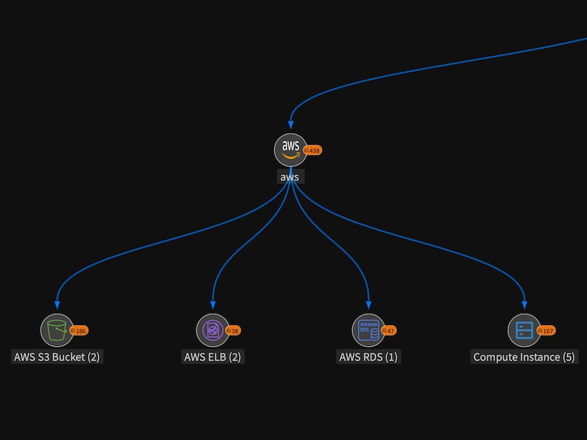

[](https://github.com/deepfence/ThreatMapper/blob/master/LICENSE) [](https://github.com/deepfence/ThreatMapper/stargazers) [](https://github.com/deepfence/ThreatMapper/issues) [](https://github.com/deepfence/ThreatMapper/issues) [](https://community.deepfence.io/docs/threatmapper) [](https://community.deepfence.io/docs/threatmapper/demo) [](https://hub.docker.com/r/deepfenceio/deepfence_agent_ce) [](https://join.slack.com/t/deepfence-community/shared_invite/zt-podmzle9-5X~qYx8wMaLt9bGWwkSdgQ) [](https://twitter.com/intent/tweet?text=Wow:&url=https%3A%2F%2Fgithub.com%2Fdeepfence%2FThreatMapper)

## :tada: ThreatMapper 1.4 發佈

> [ThreatMapper 1.4.0](https://github.com/deepfence/ThreatMapper/releases/tag/v1.4.0) 增加了威脅圖（ThreatGraph）功能，它的可視化效果豐富，使用運行環境（如網路流）來確定威脅掃描結果的優先順序。   ThreatGraph 可以幫助組織，將攻擊路徑警報數量從數千條縮小到最有意義（和最具威脅性）的幾條。 版本 1.4.0 還增加了雲資產的無代理雲安全狀態管理 （CSPM） 和主機基於代理的狀態管理，可根據行業標準合規性基準評估狀態。

# ThreatMapper - 雲原生的運行時威脅管理和攻擊路徑枚舉

Deepfence ThreatMapper 在您的生產平臺中搜尋威脅，並根據漏洞利用風險等級，對這些威脅進行排序。 它揭示了易受攻擊的軟體元件、暴露的密鑰和偏離良好安全做法的情況。  ThreatMapper 結合使用基於代理的檢查和無代理監視，提供盡可能廣泛的覆蓋範圍來檢測威脅。

借助 ThreatMapper 的**威脅圖**可視化功能，您可以確定哪些問題對應用程式安全會構成最大風險，然後將這些問題放在計劃保護或修復的優先位置上。

<table width="100%">
  <tr>
  <td align="center" valign="top" width="33%"><a href="../../raw/master/images/readme/threatmapper-topology-full.jpg"></a>
    <br/><br/>
    瞭解拓撲
  </td>
  <td align="center" valign="top" width="33%"><a href="../../raw/master/images/readme/threatmapper-vulnerabilities-full.jpg"></a>
    <br/><br/>
    識別威脅
  </td>
  <td align="center" valign="top" width="33%"><a href="../../raw/master/images/readme/threatmapper-threatgraph-full.jpg"></a>
    <br/><br/>
    探索威脅圖
  </td>
  </tr>
</table>

 * 在產品文檔中[瞭解更多有關 ThreatMapper](https://community.deepfence.io/docs/threatmapper/)的資訊。

 * 在即時演示沙箱中[查看 ThreatMapper 的運行情況](https://community.deepfence.io/docs/threatmapper/demo)。

## 何時使用 ThreatMapper

ThreatMapper 繼承了您在開發管道中已採用的良好的“shift left”安全做法。 它繼續監控正在運行的應用程式是否存在新出現的軟體漏洞，並根據行業專家基準監控主機和雲配置。

ThreatMapper 為您的生產工作負載和基礎設施，提供跨雲、kubernetes、無伺服器 （Fargate） 和本地平臺的安全觀測能力。


# ThreatMapper 入門


https://user-images.githubusercontent.com/3711627/183735806-7afc0dd3-a3ee-4486-a241-06541025a3d4.mp4


## 規劃您的部署

ThreatMapper 由兩個部分構成：

 * **ThreatMapper 管理控制台**是一個基於容器的應用程式，可以部署在單個 docker 主機上或 Kubernetes 集群中。
 * ThreatMapper 使用無代理**雲掃描程器**任務和基於代理的**感測器代理**來監控正在運行的基礎架構。

### 管理主控台

首先，您要在合適的 docker 主機或 Kubernetes 集群上，[部署管理主控台](https://community.deepfence.io/docs/threatmapper/console/)。  例如，在 Docker 上：

```shell script
# Docker installation process for ThreatMapper Management Console
sudo sysctl -w vm.max_map_count=262144 # see https://www.elastic.co/guide/en/elasticsearch/reference/current/vm-max-map-count.html

wget https://github.com/deepfence/ThreatMapper/raw/master/deployment-scripts/docker-compose.yml
docker-compose -f docker-compose.yml up --detach
```

管理主控台啟動並執行後，您可以[註冊管理員帳戶並獲取 API 金鑰](https://community.deepfence.io/docs/threatmapper/console/initial-configuration)。

### 雲掃描器任務

ThreatMapper [雲掃描器任務](https://community.deepfence.io/docs/threatmapper/cloudscanner/)負責查詢雲供應商 API，以收集配置和識別偏離合規性基準的情況。

該任務是使用 Terraform 模組部署的。 ThreatMapper Manager 控制台將提供可以與Terraforme一起部署的基本配置。 或者您可以參考專家配置來微調部署（[AWS](https://github.com/deepfence/terraform-aws-cloud-scanner)，[ Azure](https://github.com/deepfence/terraform-azure-cloud-scanner)，[ GCP](https://github.com/deepfence/terraform-gcp-cloud-scanner)）。

### 感測器代理

在您的生產或開發平臺上安裝[感測器代理](https://community.deepfence.io/docs/threatmapper/sensors/)。 感測器向管理主控台報告; 告知發現了什麼服務，並提供遙測和生成軟體依賴項清單。

ThreatMapper 感測器支援以下生產平臺：

 * [Kubernetes](https://community.deepfence.io/docs/threatmapper/sensors/kubernetes/)： Kubernetes 集群使用 helm 圖表將 ThreatMapper 感測器作為守護感測器進行部署。
 * [Docker](https://community.deepfence.io/docs/threatmapper/sensors/docker/)： ThreatMapper 感測器作為輕量容器部署。
 * [Amazon ECS](https://community.deepfence.io/docs/threatmapper/sensors/aws-ecs)： ThreatMapper 感測器是用任務定義作為守護服務進行部署的。
 * [AWS Fargate](https://community.deepfence.io/docs/threatmapper/sensors/aws-fargate)： ThreatMapper 感測器是用任務定義作為 sidecar 容器進行部署的。
 * [裸機或虛擬機](https://community.deepfence.io/docs/threatmapper/sensors/linux-host/)：ThreatMapper 感測器被部署在羽量級 Docker 運行時中。

例如，運行以下命令在 Docker 主機上啟動 ThreatMapper 感測器：

```shell script
docker run -dit --cpus=".2" --name=deepfence-agent --restart on-failure --pid=host --net=host --privileged=true \
  -v /sys/kernel/debug:/sys/kernel/debug:rw -v /var/log/fenced -v /var/run/docker.sock:/var/run/docker.sock -v /:/fenced/mnt/host/:ro \
  -e MGMT_CONSOLE_URL="---CONSOLE-IP---" -e MGMT_CONSOLE_PORT="443" -e DEEPFENCE_KEY="---DEEPFENCE-API-KEY---" -e USER_DEFINED_TAGS="" \
  deepfenceio/deepfence_agent_ce:1.4.1
```

在 Kubernetes 平臺上，將使用 [helm 圖表](https://community.deepfence.io/docs/threatmapper/sensors/kubernetes/)安裝感測器

### 下一步

訪問 [Deepfence ThreatMapper 文檔](https://community.deepfence.io/docs/threatmapper/)，瞭解如何開始，以及如何使用 ThreatMapper。


# 聯繫方式

感謝您使用 ThreatMapper。  歡迎您加入 [ThreatMapper 社區](COMMUNITY.md)。

* [Deepfence 社區網站](https://community.deepfence.io)
* [](https://join.slack.com/t/deepfence-community/shared_invite/zt-podmzle9-5X~qYx8wMaLt9bGWwkSdgQ) 有問題，需要幫助？  您可以在 Slack 上找到 Deepfence 團隊
* [](https://github.com/deepfence/ThreatMapper/issues) 您想獲取新功能或發現了問題？   提交一個 issue
* [](https://community.deepfence.io/docs/threatmapper/) 閱讀 [Deepfence ThreatMapper 文件](https://community.deepfence.io/docs/threatmapper/)
* [productsecurity@deepfence.io](SECURITY.md)：發現安全問題？   請您私信告知我們
* 更多資訊請訪問 [deepfence.io](https://deepfence.io/)


# 安全和支援

對於 ThreatMapper 專案中任何與安全相關的問題，請聯繫 [productsecurity@deepfence.io](SECURITY.md)

請根據需要提交 GitHub issue，並加入 Deepfence 社群 [Slack 頻道](https://join.slack.com/t/deepfence-community/shared_invite/zt-podmzle9-5X~qYx8wMaLt9bGWwkSdgQ)。


# 協定

Deepfence ThreatMapper 專案 （此倉庫） 是在 [Apache2 開源協定](https://www.apache.org/licenses/LICENSE-2.0)下提供的。

根據 [GitHub 的 inbound=outbound 政策](https://docs.github.com/en/github/site-policy/github-terms-of-service#6-contributions-under-repository-license)，我們也同樣接受在 Apache2 協定下，為Deepfence ThreatMapper 專案做出的[貢獻](CONTRIBUTING.md)。
