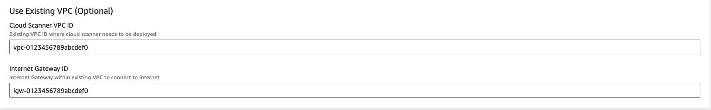

# Configuring Cloud Scanner for AWS

Cloud Scanner can be deployed using one of the following:
- [ECS - CloudFormation](#cloud-scanner-on-ecs-cloudformation)
- [ECS - Terraform](#cloud-scanner-on-ecs-terraform)
- [EKS Cluster](#cloud-scanner-on-eks-cluster)
- [EC2 Instance](#cloud-scanner-on-ec2-instance)

## Cloud Scanner on ECS (CloudFormation)

### Organization Deployment

Log in to the AWS management console account and open the following url link to deploy Cloud Scanner using CloudFormation in `us-east-1` region.

[Deploy across multiple AWS accounts in AWS organization](https://us-east-1.console.aws.amazon.com/cloudformation/home?region=us-east-1#/stacks/create/review?templateURL=https://deepfence-public.s3.amazonaws.com/cloud-scanner/self-hosted/organization-deployment/deepfence-cloud-scanner-org-common.template&stackName=Deepfence-Cloud-Scanner&param_CloudScannerImage=quay.io/deepfenceio/cloud_scanner_ce:THREATMAPPER_VERSION)

(Template URL: https://deepfence-public.s3.amazonaws.com/cloud-scanner/self-hosted/organization-deployment/deepfence-cloud-scanner-org-common.template)

Then, fill in the below parameters as needed:

|  |
|:------------------------------------------------:|
|           Cloud Scanner Configuration            |

:::info
Cloud Scanner Image: quay.io/deepfenceio/cloud_scanner_ce:THREATMAPPER_VERSION
:::

|  |
|:------------------------------------------------:|
|                     Set Name                     |

### Single Account Deployment

Log in to the AWS management console account and open the following url link to deploy Cloud Scanner using CloudFormation in `us-east-1` region.

[Deploy on a single AWS account](https://us-east-1.console.aws.amazon.com/cloudformation/home?region=us-east-1#/stacks/create/review?templateURL=https://deepfence-public.s3.amazonaws.com/cloud-scanner/self-hosted/single-account-deployment/deepfence-cloud-scanner.template&stackName=Deepfence-Cloud-Scanner&param_CloudScannerImage=quay.io/deepfenceio/cloud_scanner_ce:THREATMAPPER_VERSION)

(Template URL: https://deepfence-public.s3.amazonaws.com/cloud-scanner/self-hosted/single-account-deployment/deepfence-cloud-scanner.template)

Then, fill in the below parameters as needed:

|  |
|:------------------------------------------------:|
|           Cloud Scanner Configuration            |

|  |
|:------------------------------------------------:|
|                     Set Name                     |

#### For Deployment in Existing VPC(Optional)

If you want to deploy Cloud Scanner in an existing VPC (say, for environment where the Deepfence Management Console can only be accessed via a private IP within the VPC), you need to fill in the following params:

|  |
|:------------------------------------------------:|
|                    Choose VPC                    |

#### Configure CIDR blocks(Optional)

You may want to configure CIDR blocks to avoid collision with existing CIDR blocks:

|  |
|:------------------------------------------------:|
|                   Choose CIDRs                   |

## Cloud Scanner on ECS (Terraform)

Cloud Scanner is deployed as a task within your AWS infrastructure.

You need to configure Terraform with the appropriate resources and inputs for your particular scenario, and you will need to provide the IP address or DNS name for the ThreatMapper management console and an API key.

### Single Account Deployment

Copy and paste the following into a new file cloud-scanner.tf. Edit the fields: region, mgmt-console-url and deepfence-key.
```shell
provider "aws" {
  # AWS region: Example: us-east-1
  region = "us-east-1"
}

module "deepfence-cloud-scanner_example_single-account" {
  source                        = "deepfence/cloud-scanner/aws//examples/single-account-ecs"
  version                       = "0.6.0"
  name                          = "deepfence-cloud-scanner"
  # mgmt-console-url: deepfence.customer.com or 22.33.44.55
  mgmt-console-url              = "<Console URL>"
  mgmt-console-port             = "443"
  deepfence-key                 = "<Deepfence key>"
  # AWS Account Name (Optional, for easy identification)
  account_name                  = ""
  image                         = "quay.io/deepfenceio/cloud_scanner_ce:THREATMAPPER_VERSION"
  # Task CPU Units (Default: 4 vCPU)
  cpu                           = "4096"
  # Task Memory (Default: 8 GB)
  memory                        = "8192"
  # Task Ephemeral Storage (Default: 100 GB)
  ephemeral_storage             = "100"
  # Task role: Must be either arn:aws:iam::aws:policy/SecurityAudit or arn:aws:iam::aws:policy/ReadOnlyAccess
  task_role                     = "arn:aws:iam::aws:policy/SecurityAudit"
  debug_logs                    = false
  # Use existing VPC (Optional)
  use_existing_vpc              = false
  # VPC ID (If use_existing_vpc is set to true)
  existing_vpc_id               = ""
  # List of VPC Subnet IDs (If use_existing_vpc is set to true)
  existing_vpc_subnet_ids       = []
  tags = {
    product = "deepfence-cloud-scanner"
  }
  # AWS region: Example: us-east-1
  region                        = "us-east-1"
  ecs_vpc_region_azs            = ["us-east-1a"]
  # Optional: To refresh the cloud resources every hour, provide CloudTrail Trail ARNs (Management events with write-only or read-write).
  # If empty, a trail with management events will be automatically chosen if available.
  # e.g.: ["arn:aws:cloudtrail:us-east-1:123456789012:trail/aws-events"]
  cloudtrail_trails             = []
}
```
Ensure that the `name` parameter is set to some unique string to avoid collision with existing resource names in the account of deployment

Then run
```shell
terraform init
terraform plan
terraform apply
```

For full details, refer to the GitHub repository: https://github.com/deepfence/terraform-aws-cloud-scanner/tree/main/examples/single-account-ecs

### Organization Account Deployment

For full details, refer to the GitHub repository: https://github.com/deepfence/terraform-aws-cloud-scanner/tree/main/examples/organizational-deploy-with-member-account-read-only-access-creation

## Cloud Scanner on EKS Cluster

:::info

**Pre-requisite:**
1. Associate OIDC provider with the EKS cluster where cloud scanner is going to be deployed.

    ([refer here for aws documentation on enable-iam-roles-for-service-accounts](https://docs.aws.amazon.com/eks/latest/userguide/enable-iam-roles-for-service-accounts.html))

2. kubectl and helm command line tools are installed and configured to access the cluster where cloud scanner is going to be deployed

:::

### Single Account Cloud Scanner on EKS cluster using IRSA

1. Create the EKS IRSA role using the terraform script [single-account-eks-iam-role](https://github.com/deepfence/cloud-scanner/tree/main/cloudformation/self-hosted/eks-iam-roles/single-account-eks-iam-role)
2. If cloudformation is preferred create the EKS IRSA role using the cloudformation template [deepfence-cloud-scanner-single-account-iam-role](https://us-east-1.console.aws.amazon.com/cloudformation/home?region=us-east-1#/stacks/create/review?templateURL=https://deepfence-public.s3.amazonaws.com/cloud-scanner/self-hosted/eks-iam-roles/single-account-eks-iam-role/deepfence-cloud-scanner-single-account-iam-role.template)
3. Note **namespace**, **service account name** and **iam role arn** from the output of terraform or cloudformation deployment
4. Add Deepfence cloud scanner helm repo
    ```
    helm repo add cloud-scanner https://deepfence-helm-charts.s3.amazonaws.com/cloud-scanner
    ```
5. Download the helm chart values for depfence-cloud-scanner chart to file **cloud-scanner.yaml**
    ```
    helm show values cloud-scanner/deepfence-cloud-scanner --version CLOUD_SCANNER_HELM_CHART_VERSION > cloud-scanner.yaml
    ```
6. Update the following values in the values.yaml. Add service account annotation and service account name in **cloud-scanner.yaml** as shown in the example below
    ```yaml
    image:
      # ThreatMapper
      repository: quay.io/deepfenceio/cloud_scanner_ce

    # Format: deepfence.customer.com or 123.123.123.123
    managementConsoleUrl: ""
   
    # Auth: Get Deepfence api key from UI -> Settings -> User Management
    deepfenceKey:
      key: ""

    cloudAccount:
      # AWS account ID to monitor
      accountID: ""
      # Account name (Optional, for easy identification. Not required in organization deployment.)
      accountName: ""

      cloudProvider: "aws"
      # AWS region
      region: "us-east-1"

      # Policy set for Cloud Scanner in CloudFormation / terraform
      # arn:aws:iam::aws:policy/ReadOnlyAccess / arn:aws:iam::aws:policy/SecurityAudit
      cloudScannerPolicy: "arn:aws:iam::aws:policy/SecurityAudit"

      # Optional: AWS account ID where the helm chart is deployed, in case it is different from cloudAccount.accountID
      deployedAccountID: ""

    serviceAccount:
      # Specifies whether a service account should be created
      create: true
      # Automatically mount a ServiceAccount's API credentials?
      automount: true
      # Annotations to add to the service account
      annotations:
        "eks.amazonaws.com/role-arn": "arn:aws:iam::123456789012:role/deepfence-cloud-scanner"
      # The name of the service account to use.
      # If not set and create is true, a name is generated using the fullname template
      name: "deepfence-cloud-scanner"
    ```
7. Install the helm chart in the same *namespace* from Step 3.
    ```
    helm install -f cloud-scanner.yaml cloud-scanner cloud-scanner/deepfence-cloud-scanner \
        --namespace deepfence \
        --create-namespace \
        --version CLOUD_SCANNER_HELM_CHART_VERSION
    ```

### Organization Account Cloud Scanner on EKS cluster using IRSA

1. Create the EKS IRSA role using the cloudformation template [deepfence-cloud-scanner-organization-stackset-iam-role](https://us-east-1.console.aws.amazon.com/cloudformation/home?region=us-east-1#/stacks/create/review?templateURL=https://deepfence-public.s3.amazonaws.com/cloud-scanner/self-hosted/eks-iam-roles/organization-eks-iam-role/deepfence-cloud-scanner-organization-stackset-iam-role.template)
2. Note **namespace**, **service account name** and **iam role arn** from the output of cloudformation deployment
3. Add Deepfence cloud scanner helm repo
    ```
    helm repo add cloud-scanner https://deepfence-helm-charts.s3.amazonaws.com/cloud-scanner
    ```
4. Download the helm chart values for depfence-cloud-scanner chart to file **cloud-scanner.yaml**
    ```
    helm show values cloud-scanner/deepfence-cloud-scanner --version CLOUD_SCANNER_HELM_CHART_VERSION > cloud-scanner.yaml
    ```
5. Update the following values in the values.yaml. Add service account annotation and service account name in **cloud-scanner.yaml** as shown in the example below
    ```yaml
    image:
      # ThreatMapper
      repository: quay.io/deepfenceio/cloud_scanner_ce

    # Format: deepfence.customer.com or 123.123.123.123
    managementConsoleUrl: ""
   
    # Auth: Get Deepfence api key from UI -> Settings -> User Management
    deepfenceKey:
      key: ""

    cloudAccount:
      # Organization root account ID
      accountID: ""
      # Account name (Optional, for easy identification. Not required in organization deployment.)
      accountName: ""

      cloudProvider: "aws"
      # AWS region
      region: "us-east-1"

      # Policy set for Cloud Scanner in CloudFormation / terraform
      # arn:aws:iam::aws:policy/ReadOnlyAccess / arn:aws:iam::aws:policy/SecurityAudit
      cloudScannerPolicy: "arn:aws:iam::aws:policy/SecurityAudit"

      # Optional: AWS account ID where the helm chart is deployed, in case it is different from cloudAccount.accountID
      deployedAccountID: ""
      
      # For Organization deployment:
    
      # Is this organization deployment or single account deployment?
      isOrganizationDeployment: true
    
      # Organization root account ID
      # Should be same as cloudAccount.accountID
      organizationAccountID: ""

      # Role name. The name should be same across all accounts in the Organization deployment.
      # Role ARN example: arn:aws:iam::123456789012:role/deepfence-cloud-scanner-role
      # Role name in this case is deepfence-cloud-scanner-role
      roleName: ""

    serviceAccount:
      # Specifies whether a service account should be created
      create: true
      # Automatically mount a ServiceAccount's API credentials?
      automount: true
      # Annotations to add to the service account
      annotations:
        "eks.amazonaws.com/role-arn": "arn:aws:iam::123456789012:role/deepfence-cloud-scanner"
      # The name of the service account to use.
      # If not set and create is true, a name is generated using the fullname template
      name: "deepfence-cloud-scanner"
    ```
6. Install the helm chart in the same *namespace* from Step 2.
    ```
    helm install -f cloud-scanner.yaml cloud-scanner cloud-scanner/deepfence-cloud-scanner \
        --namespace deepfence \
        --create-namespace \
        --version CLOUD_SCANNER_HELM_CHART_VERSION
    ```

## Cloud Scanner on EC2 Instance

:::info

**Pre-requisite:**
- Install docker and docker compose on the EC2 instance([refer docker documentation for installation instructions](https://docs.docker.com/engine/install/))
- If an existing EC2 instance is used, check if docker and docker compose plugins are installed on the EC2 instance
:::

### Single Account Cloud Scanner on EC2 Instance using IAM Roles
1. Create the IAM role and instance profile for deepfence cloud scanner using the cloudformation script [deepfence-cloud-scanner-single-account-iam-role](https://us-east-1.console.aws.amazon.com/cloudformation/home?region=us-east-1#/stacks/create/review?templateURL=https://deepfence-public.s3.amazonaws.com/cloud-scanner/self-hosted/ec2/single-account-ec2-iam-role/deepfence-cloud-scanner-single-account-iam-role.template)
2. Note the instance profile from the cloudformation stack output
3. Modify the EC2 instance, add the instance profile created by cloudformation script
4. Create a directory **deepfence-cloud-scanner** and download docker-compose.yaml from the url
    ```
    https://raw.githubusercontent.com/deepfence/cloud-scanner/refs/heads/release-2.3/docker-compose.yaml 
    ```
    ```bash
    mkdir deepfence-cloud-scanner && cd deepfence-cloud-scanner
    wget https://raw.githubusercontent.com/deepfence/cloud-scanner/refs/heads/release-2.3/docker-compose.yaml
    ```
5. Update the account details and console details in the docker-compose.yaml
    ```
    image: quay.io/deepfenceio/cloud_scanner_ce:THREATMAPPER_VERSION
    environment:
      MGMT_CONSOLE_URL: "<CONSOLE_URL>"
      MGMT_CONSOLE_PORT: <CONSOLE_PORT>
      DEEPFENCE_KEY: "<DEEPFENCE_KEY>"
      CLOUD_PROVIDER: "aws"
      CLOUD_REGION: "<REGION>"
      CLOUD_ACCOUNT_ID: "<ACCOUNT_ID>"
      DEPLOYED_ACCOUNT_ID: ""
      CLOUD_ACCOUNT_NAME: ""
      ORGANIZATION_DEPLOYMENT: false
      CLOUD_ORGANIZATION_ID: ""
      ROLE_NAME: ""
      CLOUD_AUDIT_LOG_IDS: ""
      HTTP_SERVER_REQUIRED: "false"
      SUCCESS_SIGNAL_URL: ""
      DF_LOG_LEVEL: info
      SCAN_INACTIVE_THRESHOLD: "21600"
      CLOUD_SCANNER_POLICY: "arn:aws:iam::aws:policy/SecurityAudit"
    ```
6. Start the cloud scanner using docker compose 
    ```
    docker compose up -d
    ```

### Organization Account Cloud Scanner on EC2 Instance using IAM Roles
1. Create the IAM role and instance profile for deepfence cloud scanner using the cloudformation script [deepfence-cloud-scanner-organization-stackset-iam-role](https://us-east-1.console.aws.amazon.com/cloudformation/home?region=us-east-1#/stacks/create/review?templateURL=https://deepfence-public.s3.amazonaws.com/cloud-scanner/self-hosted/ec2/organization-ec2-iam-role/deepfence-cloud-scanner-organization-stackset-iam-role.template)
2. Note the instance profile from the cloudformation stack output
3. Modify the EC2 instance, add the instance profile created by cloudformation script
4. Create a directory **deepfence-cloud-scanner** and download docker-compose.yaml from the url
    ```
    https://raw.githubusercontent.com/deepfence/cloud-scanner/refs/heads/release-2.3/docker-compose.yaml 
    ```
    ```bash
    mkdir deepfence-cloud-scanner && cd deepfence-cloud-scanner
    wget https://raw.githubusercontent.com/deepfence/cloud-scanner/refs/heads/release-2.3/docker-compose.yaml
    ```
5. Update the organization account details and console details in the docker-compose.yaml
    ```
    image: quay.io/deepfenceio/cloud_scanner_ce:THREATMAPPER_VERSION
    environment:
      MGMT_CONSOLE_URL: "<CONSOLE_URL>"
      MGMT_CONSOLE_PORT: <CONSOLE_PORT>
      DEEPFENCE_KEY: "<DEEPFENCE_KEY>"
      CLOUD_PROVIDER: "aws"
      CLOUD_REGION: "<REGION>"
      CLOUD_ACCOUNT_ID: "<ROOT_ACCOUNT_ID>"
      DEPLOYED_ACCOUNT_ID: ""
      CLOUD_ACCOUNT_NAME: ""
      ORGANIZATION_DEPLOYMENT: true
      CLOUD_ORGANIZATION_ID: "<ROOT_ACCOUNT_ID>"
      ROLE_NAME: "<ROLE_NAME>"
      CLOUD_AUDIT_LOG_IDS: ""
      HTTP_SERVER_REQUIRED: "false"
      SUCCESS_SIGNAL_URL: ""
      DF_LOG_LEVEL: info
      SCAN_INACTIVE_THRESHOLD: "21600"
      CLOUD_SCANNER_POLICY: "arn:aws:iam::aws:policy/SecurityAudit"
    ```
6. Start the cloud scanner using docker compose 
    ```
    docker compose up -d
    ```

## What Compliance Scans are Performed?

ThreatMapper builds on a large library of **controls** - these are specific requirements and matching tests.  For example, you will find controls that correspond to best-practice configurations of access to assets, such as enabling TLS access and blocking plain-text HTTP.

Controls are grouped into **benchmarks**. Where multiple benchmarks are available, controls may be used by several benchmarks.

When you run a compliance scan, you can select which benchmarks you wish to measure against, and ThreatMapper will then evaluate the appropriate controls and present the results, by benchmark, once the scan has completed.

For full information, refer to [Operations: Compliance Scanning](/docs/operations/compliance).

:::tip Maximizing Coverage
For maximum coverage, you can use both Cloud Scanner and local Sensor Agent compliance scans together. You could scan your AWS infrastructure using Cloud Scanner, and [scan selected VMs deployed within AWS](other) using the Sensor Agent.
:::