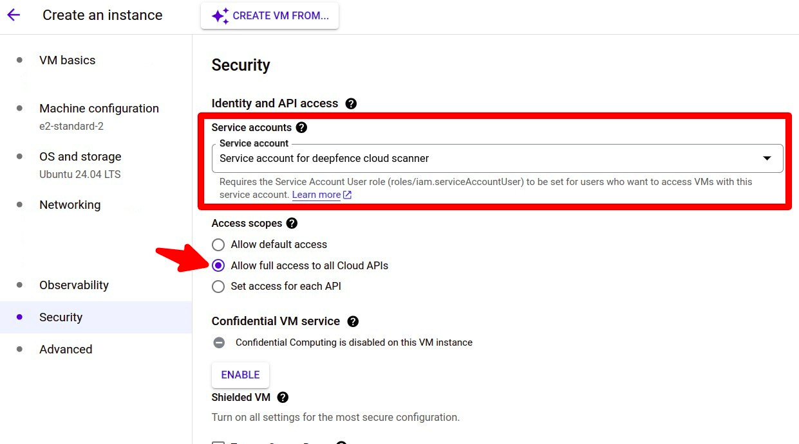

# Configuring Cloud Scanner for Google Cloud Platform

Cloud Scanner is deployed as a task within your Google Cloud Platform instance.

You need to configure Terraform with the appropriate resources and inputs for your particular scenario, and you will need to provide the IP address or DNS name for the ThreatMapper management console and an API key.

Copy and paste the following (single project or multiple projects) into a new file cloud-scanner.tf. Edit the fields: region, mgmt-console-url and deepfence-key.

## Single Project

```terraform
module "cloud-scanner_example_single-project" {
  source              = "deepfence/cloud-scanner/gcp//examples/single-project"
  version             = "0.6.0"
  name                = "deepfence-cloud-scanner"
  # mgmt-console-url: deepfence.customer.com or 22.33.44.55
  mgmt-console-url    = "<Console URL>"
  mgmt-console-port   = "443"
  deepfence-key       = "<Deepfence-key>"
  # GCP Project Name (Optional, for easy identification)
  project_name        = ""
  image_name          = "us-east1-docker.pkg.dev/deepfenceio/deepfence/cloud_scanner_ce:THREATMAPPER_VERSION"
  # project_id example: dev1-123456
  project_id          = "<PROJECT_ID>"
  # region example: asia-east1
  region              = "<REGION_ID>"
  # Optional for private ip console
  # Name of vpc network in which the management console was deployed
  vpc                 = ""
  # Optional for private ip console
  # IP CIDR range for the connector to above vpc
  # Example: 11.0.0.0/28
  ip_cidr_range_svpca = ""
  cpu                 = "2"
  memory              = "4096Mi"
  labels              = {
    name = "deepfence-cloud-scanner"
  }
}
```

## Multiple Projects (Organization Deployment)

```terraform
module "cloud-scanner_example_multiple-projects" {
  source              = "deepfence/cloud-scanner/gcp//examples/multi-project"
  version             = "0.6.0"
  name                = "deepfence-cloud-scanner"
  # org_domain: root project name
  org_domain          = ""
  # mgmt-console-url: deepfence.customer.com or 22.33.44.55
  mgmt-console-url    = "<Console URL>"
  mgmt-console-port   = "443"
  deepfence-key       = "<Deepfence-key>"
  image_name          = "us-east1-docker.pkg.dev/deepfenceio/deepfence/cloud_scanner_ce:THREATMAPPER_VERSION"
  # project_id example: dev1-123456
  project_id          = "<PROJECT_ID>"
  # region example: asia-east1
  region              = "<REGION_ID>"
  # Optional for private ip console
  # Name of vpc network in which the management console was deployed
  vpc                 = ""
  # Optional for private ip console
  # IP CIDR range for the connector to above vpc
  # Example: 11.0.0.0/28
  ip_cidr_range_svpca = ""
  cpu                 = "4"
  memory              = "8192Mi"
  labels              = {
    name = "deepfence-cloud-scanner"
  }
}
```

Ensure that the `name` parameter is set to some unique string to avoid collision with existing resource names in the project of deployment

Then run
```shell
terraform init
terraform plan
terraform apply
```

To connect to a private ip console on a vpc, this deployment will create a serverless vpc connector. Specify the vpc name of console and ip_cidr_range with a mask of /28 for the connector, default is 11.0.0.0/28.
For full details, refer to the `examples` provided in the GitHub repository: https://github.com/deepfence/terraform-gcp-cloud-scanner

Ensure that the `name` parameter is set to some unique string to avoid collision with existing resource names in the project of deployment

## What Compliance Scans are Performed?

ThreatMapper builds on a large library of **controls** - these are specific requirements and matching tests.  For example, you will find controls that correspond to best-practice configurations of access to assets, such as enabling TLS access and blocking plain-text HTTP.

Controls are grouped into **benchmarks**. Where multiple benchmarks are available, controls may be used by several benchmarks.

When you run a compliance scan, you can select which benchmarks you wish to measure against, and ThreatMapper will then evaluate the appropriate controls and present the results, by benchmark, once the scan has completed.

For full information, refer to [Operations: Compliance Scanning](/docs/operations/compliance).

:::tip Maximizing Coverage
For maximum coverage, you can use both Cloud Scanner and local Sensor Agent compliance scans together. You could scan your GCP infrastructure using Cloud Scanner, and [scan selected VMs deployed within GCP](other) using the Sensor Agent.
:::


## Cloud Scanner on GKE Cluster using workload identity

:::info

**Pre-requisite:**
1. GKE cluster with workload identity enabled.

    ([refer here for gke documentation on how to enable workload identity](https://cloud.google.com/kubernetes-engine/docs/how-to/workload-identity))

2. gcloud cli is configured and is able to access the required project where cloud scanner will be deployed

:::

Cloud Scanner is deployed as a pod within your GKE cluster

You need to configure Terraform with the appropriate resources and inputs for your particular scenario, and you will need to provide the IP address or DNS name for the ThreatMapper management console and an API key.

Copy and paste the following (single project or multiple projects) into a new file cloud-scanner.tf. Edit the fields: region, mgmt-console-url and deepfence-key.

### Single Project Cloud Scanner on GKE Cluster with workload identity

```terraform
data "google_client_config" "current" {}

# target cluster to deploy cloud scanner
data "google_container_cluster" "target_cluster" {
  name     = "<TARGET GKE CLUSTER NAME>"
  location = "<TARGET GKE CLUSTER NAME>"
  project  = "<PROJECT_ID>"
}

module "cloud_scanner_example_single_project" {
  source                     = "deepfence/cloud-scanner/gcp//examples/gke"
  version                    = "0.7.2"
  gke_host                   = "https://${data.google_container_cluster.target_cluster.endpoint}"
  gke_token                  = data.google_client_config.current.access_token
  gke_cluster_ca_certificate = base64decode(data.google_container_cluster.target_cluster.master_auth[0].cluster_ca_certificate,)
  name                       = "deepfence-cloud-scanner"
  # mgmt-console-url: deepfence.customer.com or 22.33.44.55
  mgmt-console-url           = "<Console URL>"
  deepfence-key              = "<Deepfence-key>"
  # quay.io/deepfenceio/cloud_scanner_ce if using ThreatMapper. quay.io/deepfenceio/cloud_scanner if using ThreatStryker
  image_name                 = "quay.io/deepfenceio/cloud_scanner_ce"
  image_tag                  = "2.3.1"
  # project_id example: dev1-123456
  project_id                 = "<PROJECT_ID>"
  # region example: asia-east1
  region                     = "<REGION_ID>"
  # target gke cluster to deploy cloud scanner
  cluster_name               = "<TARGET GKE CLUSTER NAME>"
  # target gke cluster location
  cluster_location           = "<TARGET GKE CLUSTER LOCATION>"
}
```

### Multiple Project Cloud Scanner on GKE Cluster with workload identity

```terraform

data "google_client_config" "current" {}

# target cluster to deploy cloud scanner
data "google_container_cluster" "target_cluster" {
  name     = "<TARGET GKE CLUSTER NAME>"
  location = "<TARGET GKE CLUSTER NAME>"
  project  = "<PROJECT_ID>"
}

module "cloud_scanner_example_multiple_project" {
  source                     = "deepfence/cloud-scanner/gcp//examples/gke"
  version                    = "0.7.2"
  name                       = "deepfence-cloud-scanner"
  gke_host                   = "https://${data.google_container_cluster.target_cluster.endpoint}"
  gke_token                  = data.google_client_config.current.access_token
  gke_cluster_ca_certificate = base64decode(data.google_container_cluster.target_cluster.master_auth[0].cluster_ca_certificate,)
  # mgmt-console-url: deepfence.customer.com or 22.33.44.55
  mgmt-console-url           = "<Console URL>"
  deepfence-key              = "<Deepfence-key>"
  # quay.io/deepfenceio/cloud_scanner_ce if using ThreatMapper. quay.io/deepfenceio/cloud_scanner if using ThreatStryker
  image_name                 = "quay.io/deepfenceio/cloud_scanner_ce"
  image_tag                  = "2.3.1"
  # project_id example: dev1-123456
  project_id                 = "<PROJECT_ID>"
  # region example: asia-east1
  region                     = "<REGION_ID>"
  # target gke cluster to deploy cloud scanner
  cluster_name               = "<TARGET GKE CLUSTER NAME>"
  # target gke cluster location
  cluster_location           = "<TARGET GKE CLUSTER NAME>"
  isOrganizationDeployment   = true
  # project id where the cloud scanner is deployed
  deployedAccountID          = "<DEPLOYED PROJECT ID>"
  # organization project id
  organizationAccountID      = "<ORG PROJECT ID>"
}
```

## Cloud Scanner on GCP compute instance using service account

:::info

**Pre-requisite:**
1. GKE cluster with workload identity enabled.

    ([refer here for gke documentation on how to enable workload identity](https://cloud.google.com/kubernetes-engine/docs/how-to/workload-identity))

2. gcloud cli is configured and is able to access the required project where cloud scanner will be deployed
3. Install docker and docker compose on the gcp compute instance([refer docker documentation for installation instructions](https://docs.docker.com/engine/install/))
4. If a existing gcp compute instance instance is used, check if docker and docker compose plugins are installed on the gcp compute instance.

:::

1. Copy and paste the following (single project or multiple projects) into a new file cloud-scanner.tf. Edit the fields: PROJECT_ID and update service account name if required.

    - Single Project Cloud Scanner on GCP compute instance with service account

      ```terraform
      data "google_client_config" "current" {}

      module "cloud_scanner_example_single_project" {
        source     = "deepfence/cloud-scanner/gcp//examples/gce-vm"
        version    = "0.7.2"
        # gcp service account name
        name       = "deepfence-cloud-scanner"
        # project_id example: dev1-123456
        project_id = "<PROJECT_ID>"
      }

      output "service_account_email" {
        value = module.cloud_scanner_example_single_project.service_account_email
      }
      ```

    - Multiple Project Cloud Scanner on GCP compute instance with service account

      ```terraform
      data "google_client_config" "current" {}

      module "cloud_scanner_example_multiple_project" {
        source                   = "deepfence/cloud-scanner/gcp//examples/gce-vm"
        version                  = "0.7.2"
        # gcp service account name
        name                     = "deepfence-cloud-scanner"
        # project_id example: dev1-123456
        project_id               = "<PROJECT_ID>"
        # org mode for multiple projects
        isOrganizationDeployment = true
      }

      output "service_account_email" {
        value = module.cloud_scanner_example_multiple_project.service_account_email
      }
      ```
2. Apply the terraform script and note the service account from the output
3. Stop the the gcp compute instance and update the service account in `API and identity management` select the service account create by the terraform script and select option `Allow full access to all Cloud APIs`, save the config and start the instance, if creating a new instance these options can be set while creating the instance

4. Create a directory **deepfence-cloud-scanner** and download docker-compose.yaml from the url
    ```
    https://raw.githubusercontent.com/deepfence/cloud-scanner/main/docker-compose.yaml
    ```
    ```bash
    mkdir deepfence-cloud-scanner && cd deepfence-cloud-scanner
    wget https://raw.githubusercontent.com/deepfence/cloud-scanner/main/docker-compose.yaml
    ```
5. Update the account details and console details in the docker-compose.yaml
6. Start the cloud scanner using docker compose
    ```
    docker compose up -d
    ```
