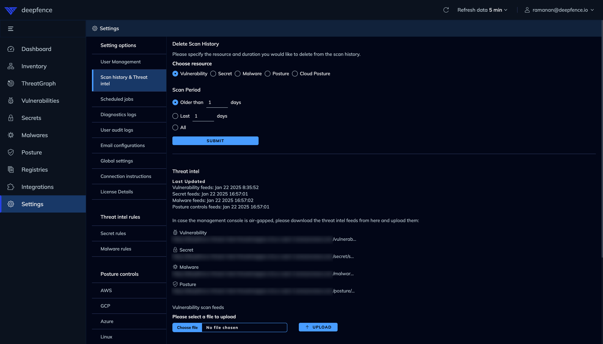

# Deploying Console into Air-Gapped Environments

When deploying management console into an air-gapped environment, you need to ensure that the console has access to the required images.

### Docker Images

You can download the images and upload them into internal docker registry.

```shell
docker pull quay.io/deepfenceio/deepfence_worker_ce:THREATMAPPER_VERSION
docker pull quay.io/deepfenceio/deepfence_server_ce:THREATMAPPER_VERSION
docker pull quay.io/deepfenceio/deepfence_ui_ce:THREATMAPPER_VERSION
docker pull quay.io/deepfenceio/deepfence_file_server_ce:THREATMAPPER_VERSION
docker pull quay.io/deepfenceio/deepfence_agent_ce:THREATMAPPER_VERSION
docker pull quay.io/deepfenceio/deepfence_cluster_agent_ce:THREATMAPPER_VERSION
docker pull quay.io/deepfenceio/deepfence_router_ce:THREATMAPPER_VERSION
docker pull quay.io/deepfenceio/deepfence_redis_ce:THREATMAPPER_VERSION
docker pull quay.io/deepfenceio/deepfence_kafka_broker_ce:THREATMAPPER_VERSION
docker pull quay.io/deepfenceio/deepfence_postgres_ce:THREATMAPPER_VERSION
docker pull quay.io/deepfenceio/deepfence_neo4j_ce:THREATMAPPER_VERSION
docker pull quay.io/deepfenceio/deepfence_compliance_scanner_ce:THREATMAPPER_VERSION
docker pull quay.io/deepfenceio/deepfence_telemetry_ce:THREATMAPPER_VERSION
```

```shell
export IMAGE_REPOSITORY=127.0.0.1:5000

docker tag quay.io/deepfenceio/deepfence_worker_ce:THREATMAPPER_VERSION ${IMAGE_REPOSITORY}/deepfence_worker_ce:THREATMAPPER_VERSION
docker tag quay.io/deepfenceio/deepfence_server_ce:THREATMAPPER_VERSION ${IMAGE_REPOSITORY}/deepfence_server_ce:THREATMAPPER_VERSION
docker tag quay.io/deepfenceio/deepfence_ui_ce:THREATMAPPER_VERSION ${IMAGE_REPOSITORY}/deepfence_ui_ce:THREATMAPPER_VERSION
docker tag quay.io/deepfenceio/deepfence_file_server_ce:THREATMAPPER_VERSION ${IMAGE_REPOSITORY}/deepfence_file_server_ce:THREATMAPPER_VERSION
docker tag quay.io/deepfenceio/deepfence_agent_ce:THREATMAPPER_VERSION ${IMAGE_REPOSITORY}/deepfence_agent_ce:THREATMAPPER_VERSION
docker tag quay.io/deepfenceio/deepfence_cluster_agent_ce:THREATMAPPER_VERSION ${IMAGE_REPOSITORY}/deepfence_cluster_agent_ce:THREATMAPPER_VERSION
docker tag quay.io/deepfenceio/deepfence_router_ce:THREATMAPPER_VERSION ${IMAGE_REPOSITORY}/deepfence_router_ce:THREATMAPPER_VERSION
docker tag quay.io/deepfenceio/deepfence_redis_ce:THREATMAPPER_VERSION ${IMAGE_REPOSITORY}/deepfence_redis_ce:THREATMAPPER_VERSION
docker tag quay.io/deepfenceio/deepfence_kafka_broker_ce:THREATMAPPER_VERSION ${IMAGE_REPOSITORY}/deepfence_kafka_broker_ce:THREATMAPPER_VERSION
docker tag quay.io/deepfenceio/deepfence_postgres_ce:THREATMAPPER_VERSION ${IMAGE_REPOSITORY}/deepfence_postgres_ce:THREATMAPPER_VERSION
docker tag quay.io/deepfenceio/deepfence_neo4j_ce:THREATMAPPER_VERSION ${IMAGE_REPOSITORY}/deepfence_neo4j_ce:THREATMAPPER_VERSION
docker tag quay.io/deepfenceio/deepfence_compliance_scanner_ce:THREATMAPPER_VERSION ${IMAGE_REPOSITORY}/deepfence_compliance_scanner_ce:THREATMAPPER_VERSION
docker tag quay.io/deepfenceio/deepfence_telemetry_ce:THREATMAPPER_VERSION ${IMAGE_REPOSITORY}/deepfence_telemetry_ce:THREATMAPPER_VERSION
docker tag quay.io/deepfenceio/deepfence_agent_ce:fargate-THREATMAPPER_VERSION ${IMAGE_REPOSITORY}/deepfence_agent_ce:THREATMAPPER_VERSION
```

```shell
export IMAGE_REPOSITORY=127.0.0.1:5000

docker push ${IMAGE_REPOSITORY}/deepfence_worker_ce:THREATMAPPER_VERSION
docker push ${IMAGE_REPOSITORY}/deepfence_server_ce:THREATMAPPER_VERSION
docker push ${IMAGE_REPOSITORY}/deepfence_ui_ce:THREATMAPPER_VERSION
docker push ${IMAGE_REPOSITORY}/deepfence_file_server_ce:THREATMAPPER_VERSION
docker push ${IMAGE_REPOSITORY}/deepfence_agent_ce:THREATMAPPER_VERSION
docker push ${IMAGE_REPOSITORY}/deepfence_cluster_agent_ce:THREATMAPPER_VERSION
docker push ${IMAGE_REPOSITORY}/deepfence_router_ce:THREATMAPPER_VERSION
docker push ${IMAGE_REPOSITORY}/deepfence_redis_ce:THREATMAPPER_VERSION
docker push ${IMAGE_REPOSITORY}/deepfence_kafka_broker_ce:THREATMAPPER_VERSION
docker push ${IMAGE_REPOSITORY}/deepfence_postgres_ce:THREATMAPPER_VERSION
docker push ${IMAGE_REPOSITORY}/deepfence_neo4j_ce:THREATMAPPER_VERSION
docker push ${IMAGE_REPOSITORY}/deepfence_compliance_scanner_ce:THREATMAPPER_VERSION
docker push ${IMAGE_REPOSITORY}/deepfence_telemetry_ce:THREATMAPPER_VERSION
```

Now follow the documentation [here](docker) to deploy the console using the internal registry.
```shell
env IMAGE_REPOSITORY=127.0.0.1:5000 docker compose up -d
```

### ThreatIntel database

You can download the latest ThreatIntel database and upload it in `Settings` page.

|  |
|:----------------------------------------------------------------:|
|                   Scan history & Threat Intel                    |