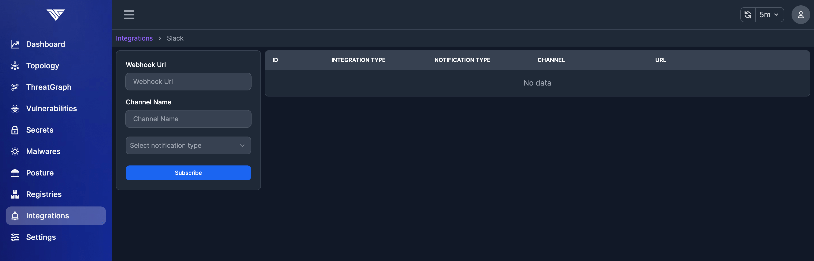

# ThreatMapper and Slack

ThreatMapper raises notifications to Slack Workspaces using Slack webhooks.

## To Configure Slack Integration

1. Navigate to https://[YourWorkspace].slack.com/apps and search for “Incoming Webhooks“ app from Slack:

   

2. Click on “Add to Slack” where you will be asked to choose a channel:

   

3. Locate the webhook URL:

   

4. Paste the webhook URL and the corresponding channel name into Deepfence Slack integration page.

   