# ThreatMapper and Splunk

ThreatMapper raises notifications to Splunk Workspaces using Splunk webhooks.

## To Configure Splunk Integration

1. Do Signup on splunk cloud
   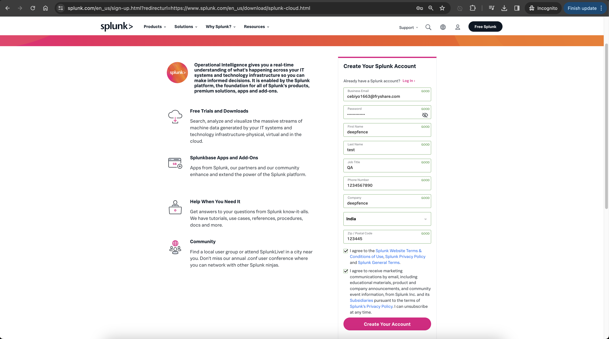
   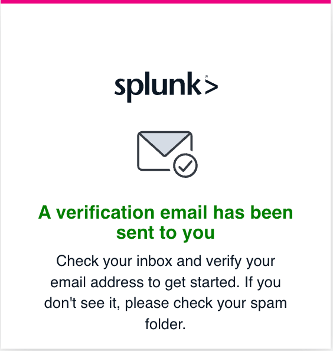
   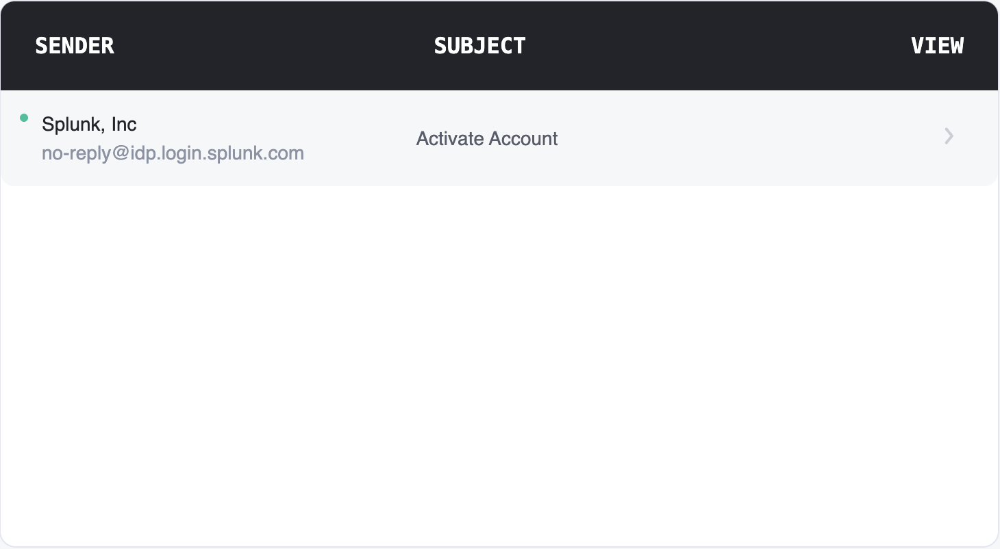

2. Verify Mail through link provided in signup mail from Splunk. After Verification, it will redirect to Splunk Cloud Trial Page.
   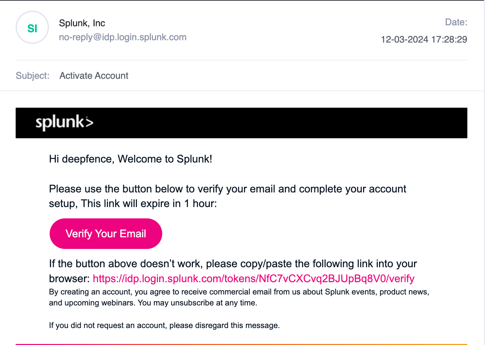
   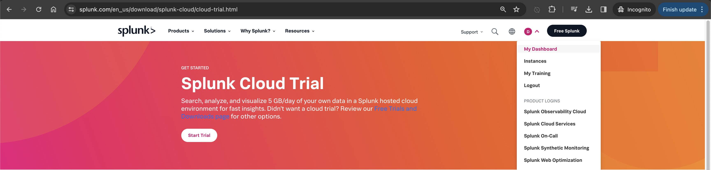

3. Start trial of Splunk cloud (https://www.splunk.com/en_us/download/splunk-cloud/cloud-trial.html)
   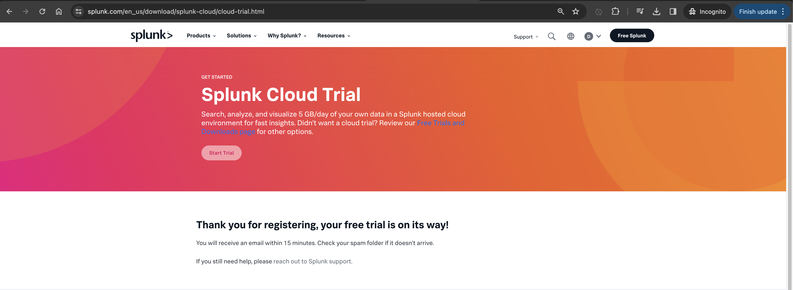

4. After trial start, Check Mail for temp credentials and splunk cloud platform url
   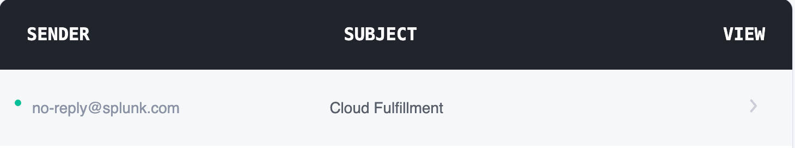
   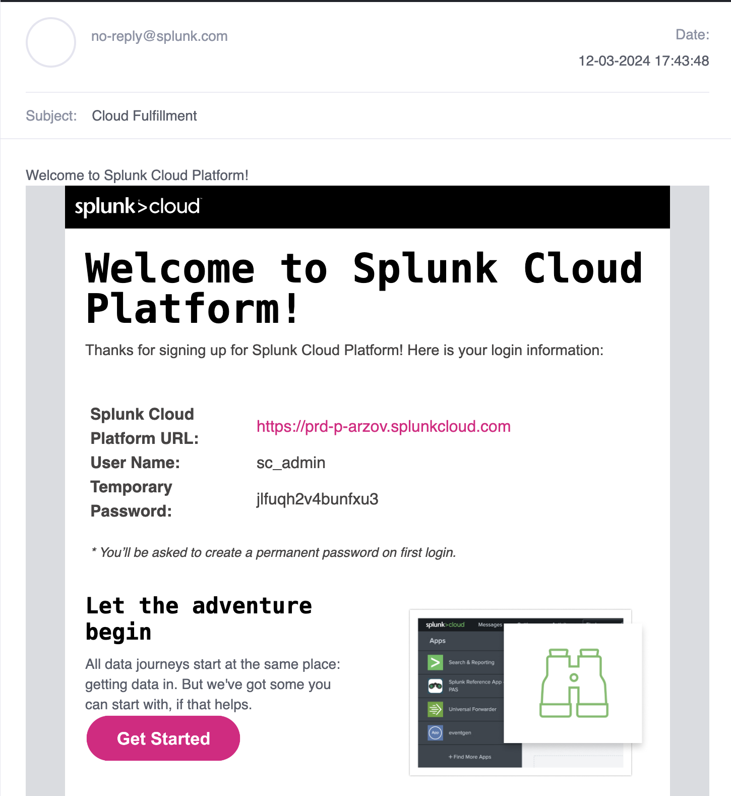

5. Try to log in with received credentials through splunk cloud platform url
   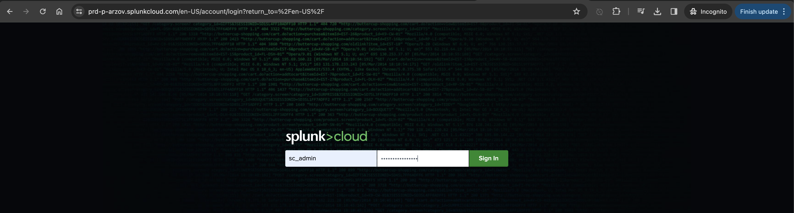
   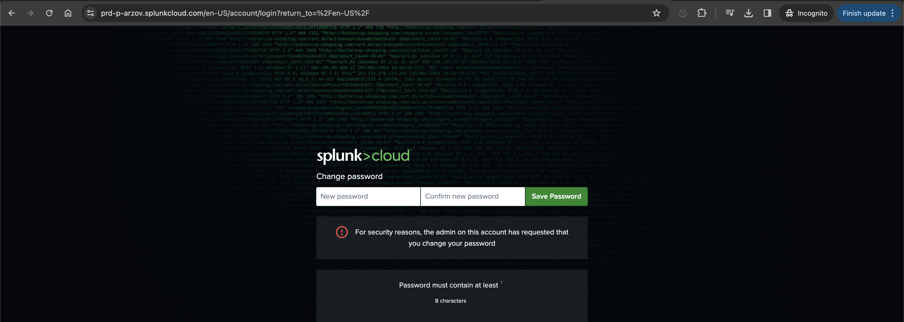
   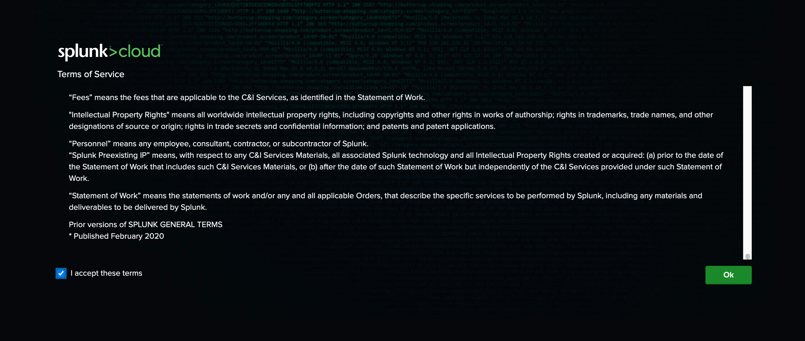
   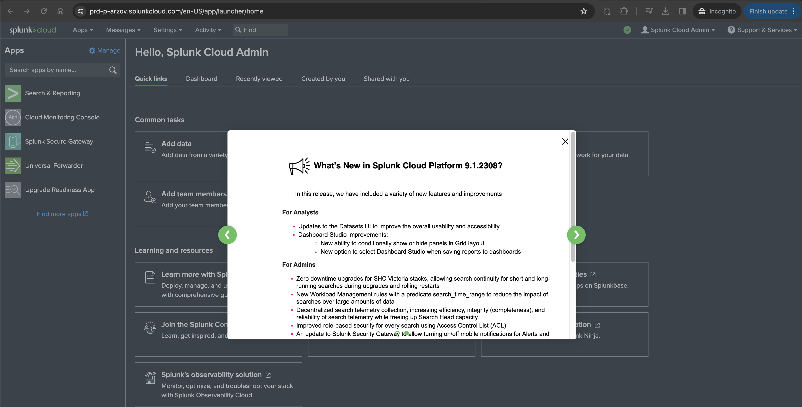
   
   
   
   
   
   
   
   
   
   

6. Final Endpoint Url: SPLUNK_CLOUD_URL:8088/services/collector/event

7. TOKEN: YOUR_GENERATED_TOKEN

8. Configure Splunk In Console
   
   

9. Now try with specific Scan(Vulnerability) according to Configured splunk integration(Vulnerability)

10. 
