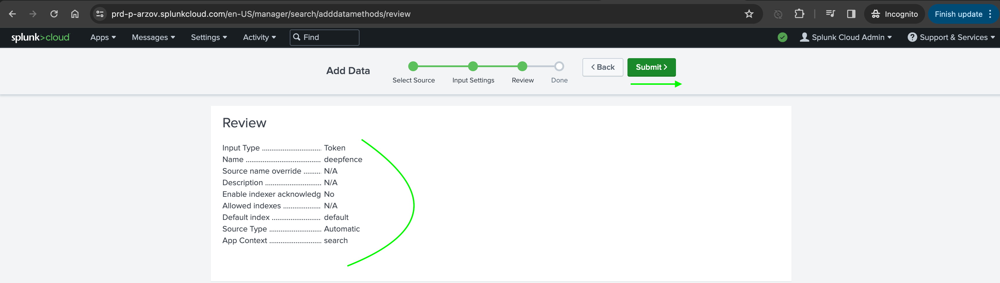
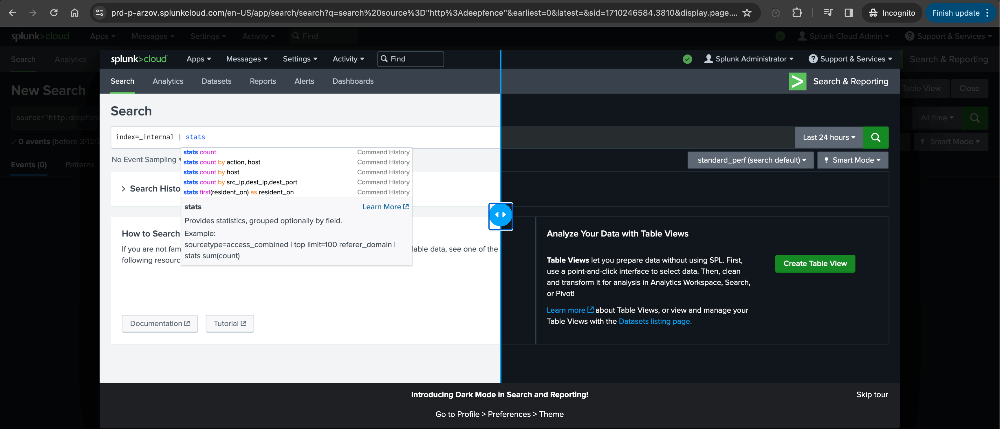
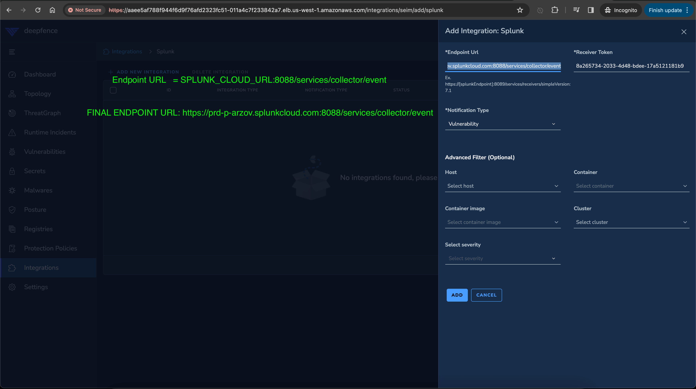

# ThreatMapper and Splunk

ThreatMapper sends notifications to Splunk using HTTP Event Collector.

## To Configure Splunk Integration

1. Log in to splunk cloud platform and click "Add data"
   
   

2. Choose HTTP Event Collector
   
   
   
   
   
   
   
   

3. Copy endpoint URL and the generated token: https://SPLUNK_CLOUD_URL:8088/services/collector/event

4. Configure Splunk integration in the Integrations page
   
   

5. You can search for scan results now in Splunk
   
