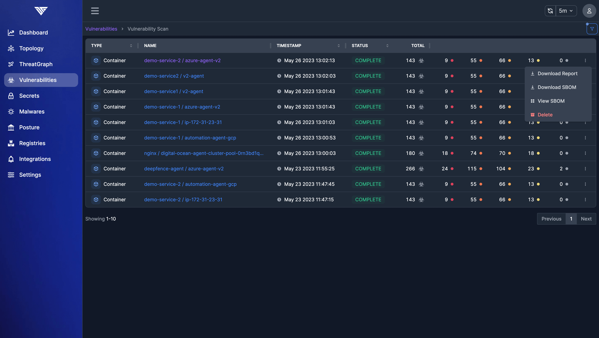
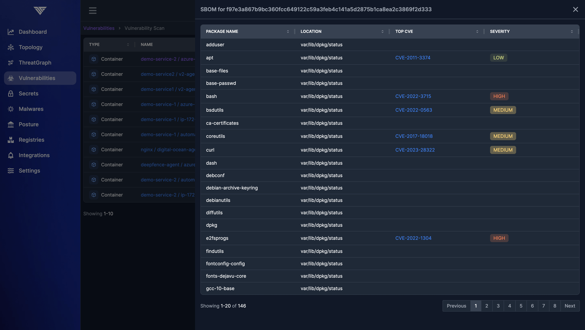

# Generating SBOMs

As part of the vulnerability scanning process, the ThreatMapper sensor interrogates the running workloads and hosts and generates a runtime SBOM (Software Bill of Materials) for each target.  This runtime SBOM is forwarded to the Management Console for vulnerability matching.

## Why generate SBOMs at runtime?

Not all production workloads go through a formal supply-chain analysis process during CI (continuous integration), and workloads can be patched and updated during runtime.  Often, the SBOM coverage is far from complete and risks being out-of-date to the runtime state.

ThreatMapper caches runtime SBOMs for scanned workloads, and makes these available for inspection through the UI and API. The runtime SBOM enumerates all the packages and software items deployed in the workload, which may drift from the at-build-time SBOM.

## Inspecting and Extracting the runtime-generated SBOM

SBOMs are associated with vulnerability scans.

Navigate to the **Vulnerabilities** > **View All Scans** results page, and locate the scan for which you would like to obtain the SBOM:

You can page through the SBOM results, or download the results as a detailed JSON file:

