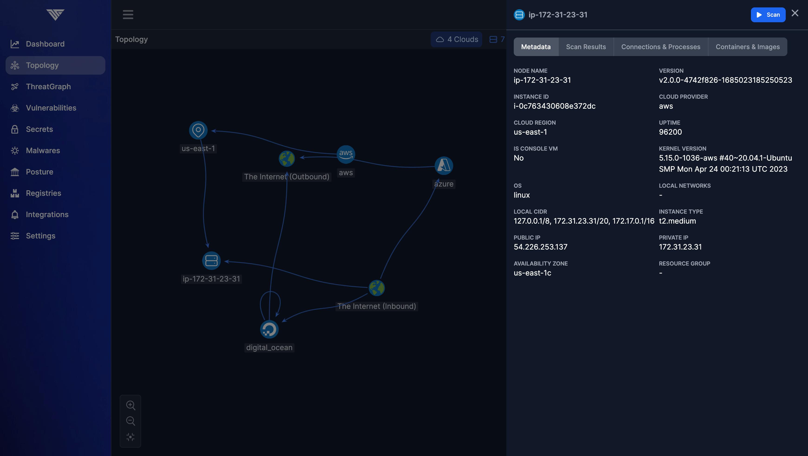
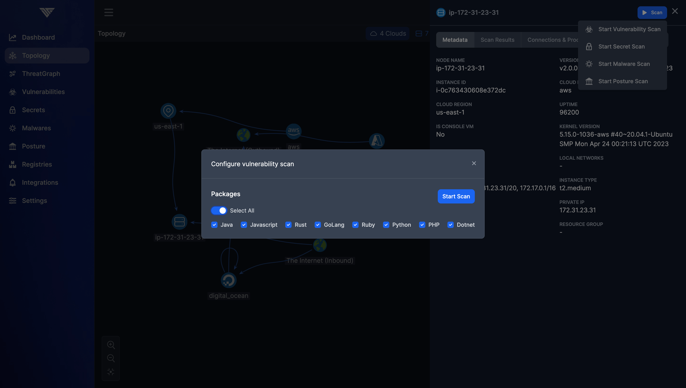

# Scanning Production Workloads

Once the ThreatMapper Management Console has been deployed and Sensor Agents have been deployed to your production platforms, the Management Console will begin to discover the workloads and infrastructure in your production platforms.

The Management Console will also begin to initialize its cache of Threat Feeds.

## Running the First Scan

The first thing you may want to do is to start a Vulnerability scan of some of your production workloads:

1. Using the Topology view, select a workload or infrastructure component to scan.  For example, you can select a Kubernetes hosts or a running container:
   * ThreatMapper excludes some resources from the Scan. It will not scan system containers, and some resources are placeholders for the elements in the topology graph
   * Click the 'Actions' button for the selected node and then click 'Start Vulnerability Scan'

   

2. Chose what you would like to scan:
   * ThreatMapper scans the base operating system, and optionally runs language scans on the object.

   

3. Start the scan:
   * The ThreatMapper Sensor will inspect the local environment, identifying objects that are scannable (such as containers and language installs).  The agent unpacks running containers to inspect each layer.
   * The agent then generates a runtime SBOM of installed packages for each object and forwards this to the Management Console. The Management Console then matches these SBOMs against the Threat Feeds it has cached.

4. Wait for the results:
   * The scan is queued and executed.  Any vulnerability alerts are notified using the configured Notification Integrations.
   * Once the scan completes, the results can be viewed on the **Vulnerabilities** pane in the Management Console.

## Understanding the Results

The **Vulnerabilities** pane displays two reports:

1. A combined, summary report of the **Most Exploitable Vulnerabilities**
2. A full log of each **Vulnerability Scan**

### Vulnerability Scan

Begin with the **Vulnerability Scan**; you'll see the results of the scan you started previously.  ThreatMapper reports on hosts, containers and other types of assets it finds on the scanned objects.

It's not uncommon to see hundreds or even thousands of potential vulnerabilities across a series of hosts and workloads. Typically, the large majority of these vulnerabilities are of no practical concern; they require local access, cannot be used to raise privileges, are not in any accessible code path, etc.  The CVSS [score](https://nvd.nist.gov/vuln-metrics/cvss) and [vector](https://www.first.org/cvss/calculator/3.0) give a measure of the risk a vulnerability poses, but don't factor in the context of your application.

### Most Exploitable Vulnerabilities

The **Most Exploitable Vulnerabilities** report combines all vulnerability scan data with the topology of the application to present a list of the most serious vulnerabilities that have the greatest potential to be exploited.

ThreatMapper combines the CVSS and other data with the learned topology of the application, the workloads which are currently running, and the possible paths that attack traffic might take.  ThreatMapper combines this measure with the CVSS score and vector to give a single vulnerability score (from 0-10) that ranks vulnerabilities by their risk and potential severity of exploit.

The **Top Attack Paths** on the vulnerability page presents a quick visualisation of the most direct way to exploit the top vulnerabilities.

## Secrets Scans

ThreatMapper (from release 1.3.0) can also perform Secret Scans on containers and production filesystems.  These scans interrogate the target filesystems, looking for possible unprotected secrets, and use a database of over 140 different token, key and password types.

False positives and deliberately-included secrets are inevitable with the scans, so it is worth inspecting the results and 'masking' ones you are prepared to accept:

## Malware Scans

ThreatMapper (from release 1.4.0) can also perform Malware Scans on containers and production filesystems. These scans use Yara rules to match for malware in the target filesystems.

