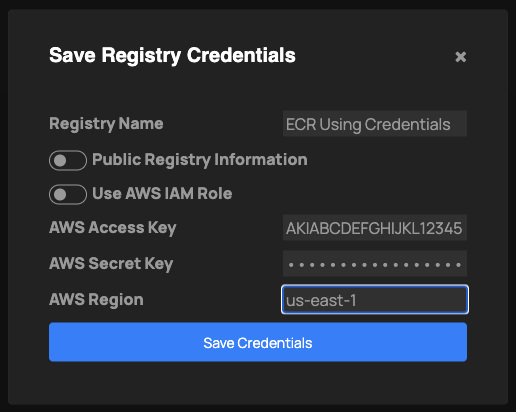
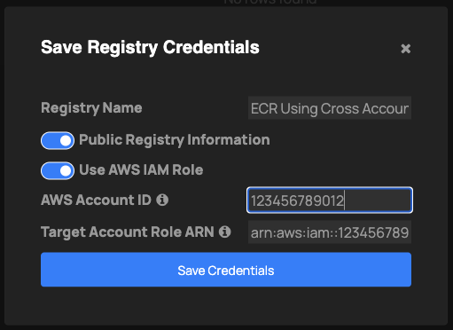

# AWS ECR

You can add your private and public ECR repositories to ThreatMapper to scan for vulnerabilities, secrets and malwares.

## Adding ECR repository

1. Select `ECR` registry type from the registries section.

    
2. Click on **+ Add Registry** button to get the following menu:

    
3. Enter `Registry Name` for reference later. Then, enter the other details as per the deployment.
    1. [Using Credentials (AWS Access Key and Secret Key)](#using-credentials)
    2. [Using AWS IAM Role](#using-aws-iam-role)
    3. [Using AWS IAM Role (with Cross-Account ECR Registry)](#using-aws-iam-role-with-cross-account-ecr-registry)

### Using Credentials

4. Fill in the credentials(`AWS Access Key`, `AWS Secret Key`) for the user with access to the ECR registry.
5. For private registry, fill in the `AWS Region` where the registry is located. Else, for public registry, toggle `Public Registry Information`.

    

### Using AWS IAM Role

The Deepfence Console needs to be deployed on AWS EC2 instance in the same AWS account as the ECR registry and the EC2 instance needs to be assigned an IAM role with the correct permissions

4. The IAM role to be assigned to the Deepfence Console EC2 instance can be deployed using CloudFormation with [deepfence-ecr-role-setup.template](https://deepfence-public.s3.amazonaws.com/ecr/deepfence-ecr-role-setup.template).
    1. [Link to create IAM role](https://us-east-1.console.aws.amazon.com/cloudformation/home?region=us-east-1#/stacks/create/review?templateURL=https://deepfence-public.s3.amazonaws.com/ecr/deepfence-ecr-role-setup.template&stackName=Deepfence-ECR-Read-Only-Role). Change region, if required. Once completed, go to `Outputs` tab and copy the value of `InstanceProfileARN`

        
    2. Assign the instance profile to the EC2 instance on which the Deepfence Console is hosted.

        
5. For private registry, fill in the `AWS Region` where the registry is located. Else, for public registry, toggle `Public Registry Information`.
6. Leave the `AWS Account ID` and `Target Account Role ARN` fields blank as they are only used for the cross-account scenario below.

    

### Using AWS IAM Role (with Cross-Account ECR Registry)

If a user has an ECR registry in one AWS account and Deepfence Console is deployed in another AWS account, the user needs to set up cross-account ECR registry access as per the following steps:

4. Create a role in the target ECR registry account which has required pull permissions. This can be deployed using CloudFormation with [deepfence-cross-acc-ecr-role-setup.template](https://deepfence-public.s3.amazonaws.com/cross-account-ecr/deepfence-ecr-role-setup.template)
    1. [Link to create role](https://us-east-1.console.aws.amazon.com/cloudformation/home?region=us-east-1#/stacks/create/review?templateURL=https://deepfence-public.s3.amazonaws.com/cross-account-ecr/deepfence-ecr-role-setup.template&stackName=Deepfence-ECR-Cross-Account-Read-Only-Role). Change region, if required. Once completed, go to `Outputs` tab and copy the value of `RoleARN`

        
5. Create a role in the account where Deepfence Console is deployed to assume the role created in the step above. This can be achieved using CloudFormation with [deepfence-console-account-setup.template](https://deepfence-public.s3.amazonaws.com/cross-account-ecr/deepfence-console-account-setup.template).
    1. [Link to create cross-account instance role](https://us-east-1.console.aws.amazon.com/cloudformation/home?region=us-east-1#/stacks/create/review?templateURL=https://deepfence-public.s3.amazonaws.com/cross-account-ecr/deepfence-console-account-setup.template&stackName=Deepfence-Cross-Account-ECR-Access-Role). Paste the `RoleARN` copied from above step into `ECRAccessRole` box.

        
    2. Once completed, go to `Outputs` tab and copy the value of `InstanceProfileARN`.

        

6. Assign the instance profile role ARN created above to the Deepfence Console EC2 instance.

    
7. For private registry, fill in the `AWS Region` where the registry is located. Else, for public registry, toggle `Public Registry Information`.
8. Fill the account id of the target account where registry is located in the `AWS Account ID` field. In the `Target Account Role ARN` field, paste the value of the `RoleARN` from the above steps.

    
