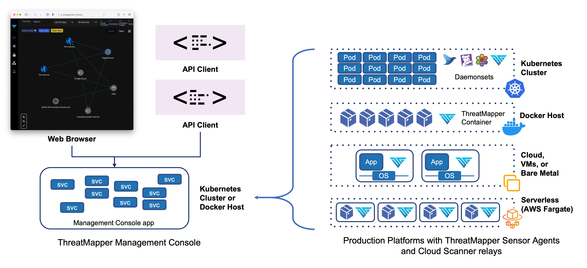

The ThreatMapper product consists of a Management Console, and multiple Sensor containers that are deployed within your production platform(s).

You should install the Management Console first. The Management console generates an API key and a URL which you will need when you install the Sensor containers.

The Management Console is managed over TLS (port 443), used for administrative traffic and for sensor traffic.  You should firewall or secure access to this port so that only authorised admin users and remote production platforms are able to connect.

## ThreatMapper Management Console

The Management Console may be installed on a single Docker host or in a dedicated Kubernetes cluster:

  * A Docker Host is suitable for small-scale deployments, managing up to several hundred production nodes
  * A Kubernetes Cluster is suitable for small and large-scale deployments 

| Feature                                   | Requirements (Docker)                                                     | Requirements (Kubernetes)           | 
|-------------------------------------------|---------------------------------------------------------------------------|-------------------------------------|
| CPU: No of cores                          | 4                                                                         | 3 nodes, 4 cores each               |
| RAM                                       | 16 GB                                                                     | 3 nodes, 8 GB each                  |
| Telemetry and data from Deepfence Sensors | Port 443 (configurable), firewalled                                       | Port 443 (configurable), firewalled |
| Administrative and API access             | Port 443 (configurable), firewalled                                       | Port 443 (configurable), firewalled |
| Docker binaries                           | *Version 20.10.8 (minimum version 18.06.0)                                |
| Docker-compose binary                     | *[Version 1.29.2](https://github.com/docker/compose/releases/tag/1.29.2)* |
| Tuning                                    | `sysctl -w vm.max_map_count=262144` # [details](https://www.elastic.co/guide/en/elasticsearch/reference/current/vm-max-map-count.html) |

Larger deployments, managing 250 or more production nodes, will require additional CPU and RAM resources.  For enterprise-scale deployments, managing 1000+ production nodes, the ThreatMapper Console should be deployed on a Kubernetes cluster of 3 or more nodes.

## ThreatMapper Sensor Containers

Sensor containers can be deployed directly to Kubernetes or Fargate, or can be deployed on a Docker environment.  If you wish to monitor a Linux-based virtual machine or bare-metal production server, you should install a docker runtime within the host Linux operating system:

| Feature              | Requirements (Docker)                                                      |
|----------------------|----------------------------------------------------------------------------|
| CPU: No of cores     | 0.2 units of 1 core                                                        |
| RAM                  | 50 mb to 100 mb                                                            |
| Linux kernel version | >= 4.4                                                                     |
| Docker binaries      | *Version 18.03 or later*                                                   |
| Connectivity         | Access to Deepfence Management Console IP address, port 443 (configurable) |

For Windows Server hosts, experimental support exists but it is not suitable for production use.
