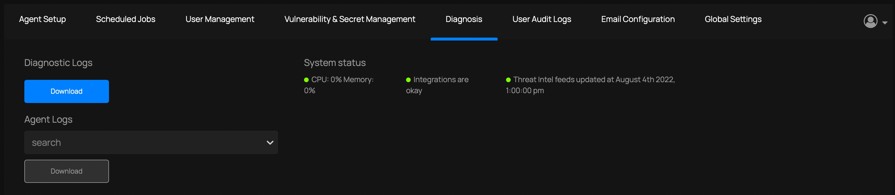

Once you have installed the Management Console, you need to register an admin user and obtain the API key needed by the ThreatMapper sensors.  You can also configure the URL for the Management Console, and provide your own TLS certificates.

You will need the IP address for the management console:

* On a Docker host, you can find the external, routable IP address of the host using `hostname -I`.
* On a Kubernetes host, find the external IP address of the load balancer for the `deepfence-router` service (`kubectl get --namespace default svc -w deepfence-router`).

## Initial Configuration

1. Open the Console in a browser (https://A.B.C.D/):
    
    

2. Create a new account. Once one user has been registered, additional users are added by invitation from an admin user:

    
    
    Account Registration details are private to your Management Console, and are not shared with Deepfence or other third parties.

3. Obtain the Deepfence API key from the console. Go to `Settings` -> `User Management` and make note of the API key; you will need it when deploying the Deepfence sensors. 

   Once the Console has started, it will begin to acquire the Threat Intel feed data; this can take up to an hour. You can install sensors and browse the topology of your applications, but you will not be able to perform vulnerability scans until the threat feeds have been fully acquired. You can check the status on the Console, at `Settings` -> `Diagnosis`; look for the **System Status** report.

   


## Configuring Access to the Management Console (optional)

By default, the Management Console is accessed by IP address (https://A.B.C.D/) and uses a self-signed certificate.

You can configure the URL used to access the Management Console, and you can provide your own TLS certificate

### Configuring the URL

Go to **Settings** > **Global Settings** and edit the **Deepfence Console URL**.

### Using your own TLS certificates - Docker

On the console machine, place the certificate and private key in `/etc/deepfence/certs` folder. Deepfence looks for the file with `.key` and `.crt` extensions on the specified location on the host:

```shell script 
  # Provide the SSL key and cert, for example, using OpenSSL to create a self-signed pair
  sudo openssl req -x509 -newkey rsa:4096 \
      -keyout /etc/deepfence/certs/sslkey.key -out /etc/deepfence/certs/sslcert.crt \
      -days 365 -nodes

  # restart the management console to use the new TLS certificate
  docker-compose -f docker-compose.yml down
  docker-compose -f docker-compose.yml up -d
```

### Using your own TLS certificates - Kubernetes

Follow the instructions to [tune the Helm chart installation](..//tree/master/deployment-scripts/helm-charts/deepfence-console#install-deepfence-console-helm-chart).
