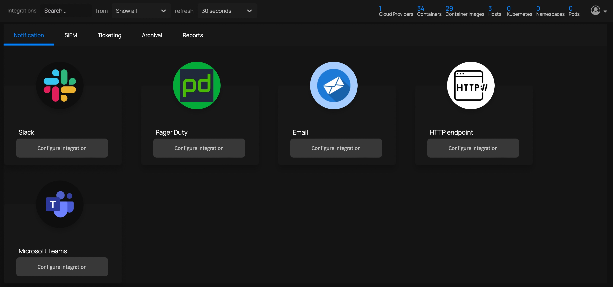

You can integrate ThreatMapper with a variety of notification services.  Any time a new vulnerability is detected (for example, during [CI](Scanning-CI) or an [automated scan](Automating-Production-Scans), ThreatMapper will submit the details to the configured notification services.

## Configuring Notification Services

The following notification services are among those supported by ThreatMapper:   
   * [Slack](Notifications-Slack): ThreatMapper raises notifications to Slack Workspaces using Slack webhooks.
   * [Sumo Logic](Notifications-Sumo-Logic): ThreatMapper raises notifications to Sumo Logic using Sumo Logic collectors. 
   * [PagerDuty](Notifications-PagerDuty): ThreatMapper raises notifications to PagerDuty using the PagerDuty API (v1 or v2).

Check out the **Integrations** pages in the Management Console for a full list.

