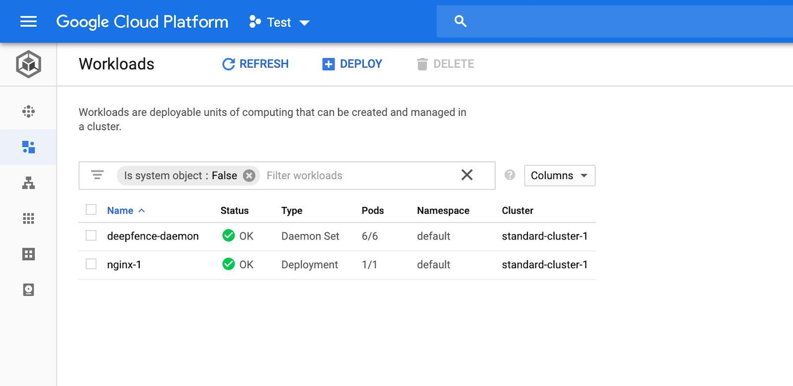

In GKE, the ThreatMapper agents are deployed as a daemonset in the cluster.

## ThreatMapper Console

The ThreatMapper management console is installed separately, outside of the GKE cluster, following the [installation instructions](Installing-the-Management-Console).

## ThreatMapper Agents

1. Connect to your GKE cluster using gcloud shell.


2. Grant permissions for the installation with following command (upto k8s v1.11):

   ```
   kubectl create clusterrolebinding "cluster-admin-$(whoami)" --clusterrole=cluster-admin --user="$(gcloud config get-value core/account)"
   ```

3. Start deepfence agent (replace `x.x.x.x` with the IP address of the Management Console and `C8TtyEtNB0gBo1wGhpeAZICNSAaGWw71BSdS2kLELY0` with api key)

   ```shell script
   helm repo add deepfence https://deepfence-helm-charts.s3.amazonaws.com/threatmapper
   helm show readme deepfence/deepfence-agent
   helm show values deepfence/deepfence-agent

   helm install deepfence-agent deepfence/deepfence-agent \
       --set managementConsoleUrl=x.x.x.x \
       --set deepfenceKey=C8TtyEtNB0gBo1wGhpeAZICNSAaGWw71BSdS2kLELY0
   ```

   Optionally specify a named [tagged release](https://github.com/deepfence/ThreatMapper/releases):

   ```shell script
   helm install deepfence-agent deepfence/deepfence-agent \
       --set managementConsoleUrl=x.x.x.x \
       --set deepfenceKey=C8TtyEtNB0gBo1wGhpeAZICNSAaGWw71BSdS2kLELY0
       --set image.tag=1.3.1 --set image.clusterAgentImageTag=1.3.1
   ```

4. The ```deepfence-agent-daemon``` will be visible in Workloads page alongside other workloads in the cluster


