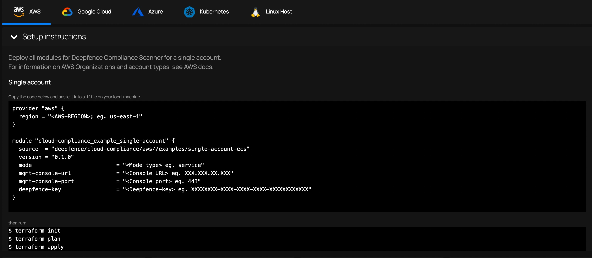

# Configuring Cloud Scanner for AWS

## CloudFormation

Open the following url link to deploy Cloud Scanner using CloudFormation in `us-east-1` region.

[https://us-east-1.console.aws.amazon.com/cloudformation/home?region=us-east-1#/stacks/create/review?templateURL=https://deepfence-public.s3.amazonaws.com/cloud-scanner/deepfence-cloud-scanner.template&stackName=Deepfence-Cloud-Scanner](https://us-east-1.console.aws.amazon.com/cloudformation/home?region=us-east-1#/stacks/create/review?templateURL=https://deepfence-public.s3.amazonaws.com/cloud-scanner/deepfence-cloud-scanner.template&stackName=Deepfence-Cloud-Scanner)

(Template URL: https://deepfence-public.s3.amazonaws.com/cloud-scanner/deepfence-cloud-scanner.template)

## Terraform

https://registry.terraform.io/modules/deepfence/cloud-scanner/aws/latest/examples/single-account-ecs#usage

Cloud Scanner is deployed as a task within your AWS infrastructure. The ThreatMapper console provides a simple terraform script to perform the deployment.

|  |
| :--: |
| Compliance Install - AWS |

You need to configure Terraform with the appropriate resources and inputs for your particular scenario, and you will need to provide the IP address or DNS name for the ThreatMapper management console and an API key.

For full details, refer to the `examples` provided in the GitHub repository: https://github.com/deepfence/terraform-aws-cloud-scanner

## What Compliance Scans are Performed?

ThreatMapper builds on a large library of **controls** - these are specific requirements and matching tests.  For example, you will find controls that correspond to best-practice configurations of access to assets, such as enabling TLS access and blocking plain-text HTTP.

Controls are grouped into **benchmarks**. Where multiple benchmarks are available, controls may be used by several benchmarks.

When you run a compliance scan, you can select which benchmarks you wish to measure against, and ThreatMapper will then evaluate the appropriate controls and present the results, by benchmark, once the scan has completed.

For full information, refer to [Operations: Compliance Scanning](/docs/threatmapper/operations/compliance).

:::tip Maximizing Coverage
For maximum coverage, you can use both Cloud Scanner and local Sensor Agent compliance scans together. You could scan your AWS infrastructure using Cloud Scanner, and [scan selected VMs deployed within AWS](other) using the Sensor Agent.
:::