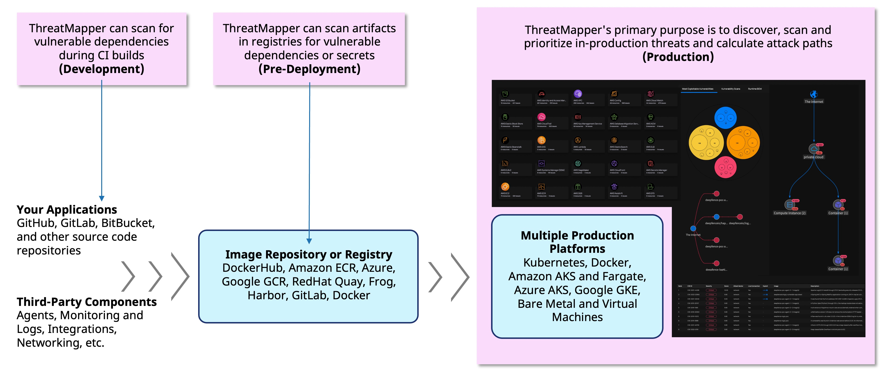
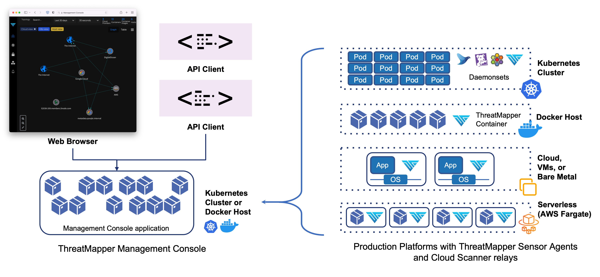

# ThreatMapper

## Introducing Deepfence ThreatMapper

Deepfence ThreatMapper hunts for hidden threats in your production platforms, and ranks these threats based on their risk-of-exploit. You can then prioritize the issues that present the greatest risk to the security of your applications.

## ThreatMapper Extends Security into Production 

Your 'Shift Left' initiatives enable you to deliver secure applications to production. ThreatMapper picks up once your applications have been deployed to production:

* **Discover Running Workloads:** ThreatMapper scans your platforms and identifies pods, containers, applications, and infrastructure.  Use ThreatMapper to discover the topology of your applications and attack surface.
* **Discover Cloud and Infrastructure Assets:** ThreatMapper queries platform APIs to map assets and their inter-relationships, and calcualate a topology graph.
* **Discover Vulnerabilities:** ThreatMapper generates runtime SBOMs (Software Bill of Materials) of dependencies from running pods and containers, serverless apps, applications, and operating systems.  ThreatMapper matches these SBOMs against multiple vulnerability feeds to identify vulnerable components.
* **Discover Exposed Secrets:** Unprotected keys, tokens and passwords can provide malicious actors with opportunities to spread control and exploit nearby or remote systems.
* **Discover Configuration and Compliance Weaknesses:** ThreatMapper evaluates infrastructure configuration against multiple compliance benchmarks (CIS, PCI-DSS, HIPAA and others) to find weaknesses and mis-configurations that could pose a threat. 
* **Rank Threats by Risk-of-Exploit:** ThreatMapper ranks the discovered threats using CVSS and other severity scores, exploit method and their proximity to attack surface, in order to identify which issues pose the greatest risk of exploit:

## ThreatMapper Architecture

Deepfence ThreatMapper consists of two parts - the ThreatMapper Management Console, and a series of ThreatMapper Sensors:

* The console uses infrastructure APIs to scan your production and non-production platforms, evaluate threats and build a visual 'Threat Graph'.  
* The console also takes data from ThreatMapper sensors to calculate the topology of your applications, generate SBOMs to find vulnerabilities, and displays a 'Threat Map' for your applications.
* ThreatMapper sensors are be deployed within your production platforms, and they forward SBOMs and telemetry securely to your dedicated console.   

### Comparing Agent-Less and Agent-Based operation

ThreatMapper uses both agent-less and agent-based operations to discover the widest-possible range of threats and render them in 'Threat Graphs' and 'Threat Maps'. You can use either or both operations, and can configure their access to your production and non-production systems in line with your own security posture.

| | Agent-Less | Agent-Based |
| --- | --- | --- |
| Implementation | Direct access to infrastructure APIs, using a secured 'Cloud Connector' relay depployed local to the cloud instance | Lightweight, privileged container ('sensor' or 'agent') with access to local resources on the host |
| Visibility | Cloud configuration and assets, as exposed through cloud or infrastrucutre API | Local assets, including filesystem, process list, local containers and pods, and kernel interfaces |
| Capability | Identifies deviation from good practice configuration ("Compliance Scanning") for cloud platforms | Identifies network flows and performs vulnerability, secret and local host (Linux/Kubernetes) compliance scanning |
| Output | Agent-less data is reported in the 'Threat Graph', which shows compliance-related issues | Agent-based data is reported in the Threat Map (for vulnerabilities, secrets etc) and Threat Graph (for compliance issues) |

### The ThreatMapper Management Console

The ThreatMapper Management Console ("Console") is a standalone application, implemented as a fleet of containers.  It should be deployed on either a single docker host, or (for larger deployments) a dedicated Kubernetes cluster.  The console is self-contained, and exposes an HTTPS interface for administration and API automation.

The console allows you to:

* Manage the users who can access the console.
* Configure Infrastructure API access and interrogate platform configurations.
* Visualize and drill down into Kubernetes clusters, virtual machines, containers and images, running processes, and network connections in near real time.
* Invoke vulnerability scans on running containers and applications and review the results, ranked by risk-of-exploit.
* Invoke compliance scans on infrastrucutre configuration ('agentless') and on infrastructure hosts ('agent-based'), manually or automatically when they are added to a cluster.
* Scan container registries for vulnerabilities, to review workloads before they are deployed.
* Scan image builds during the CI/CD pipeline, supporting CircleCI, Jenkins, and GitLab.
* Scan containers and host filesystems for unprotected secrets, including access tokens, keys and passwords.
* Configure integrations with external notification, SIEM and ticketing systems, including Slack, PagerDuty, Jira, Splunk, ELK, Sumo Logic, and Amazon S3.
ThreatMapper supports multiple production deployments simultaneously, so that you can visualize and scan workloads across a large production estate.

### ThreatMapper Sensors

ThreatMapper Sensors are deployed on your production platforms.  They communicate securely with your ThreatMapper Management Console, taking instructions to retrieve SBOMs and run scans, and forwarding telemetry data.

The sensors support the following production platforms:

* **Kubernetes:** The sensors are deployed as a daemonset, similar to other kubernetes services.
* **Docker:** The sensor is deployed as a docker container on each docker host.
* **Bare metal and VM-based platforms:** Sensors are deployed as a Docker container on each Linux operating system instance, using a Docker runtime. Linux instances are supported; Windows Server is not supported, although an experimental implementation is available.
* **AWS Fargate** The sensor is deployed as a daemon service alongside each serverless instance.
