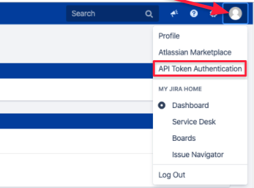
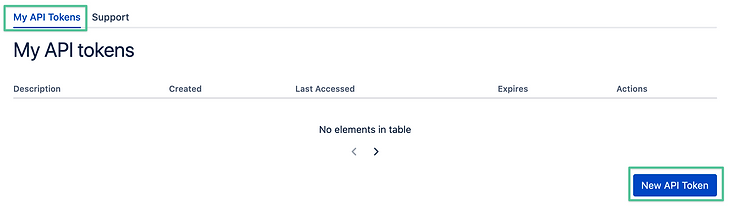
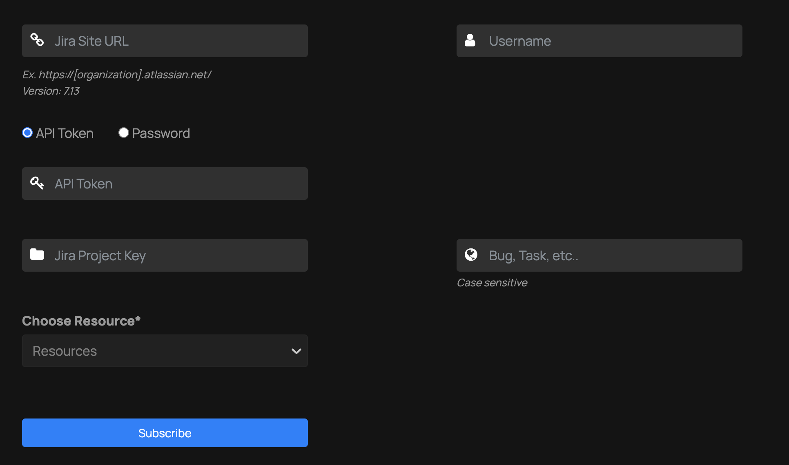

# ThreatMapper and JIRA

ThreatMapper can be configured to raise JIRA tickets for vulnerabilities and secrets. The minimum supported version of JIRA is 7.13.

## To Configure JIRA Integration
For authentication either password of a user account or an api token can be used.
To generate an api token:
1. API Token Authentication menu will be accessible from the Jira user profile menu:
   

2. Once you navigate there, click the button to generate a new API Token :

   

3. Enter token description and expiration time:
   

4. On the Threatmapper Jira integrations page enter the jira site url, username, api token. 
   The JIRA project key is the prefix of the issue numbers , e.g. issue "JRA-123" has "JRA" as project key
   Enter the type of ticket you would want ThreatMapper to create (Task / Bug etc.):
   
