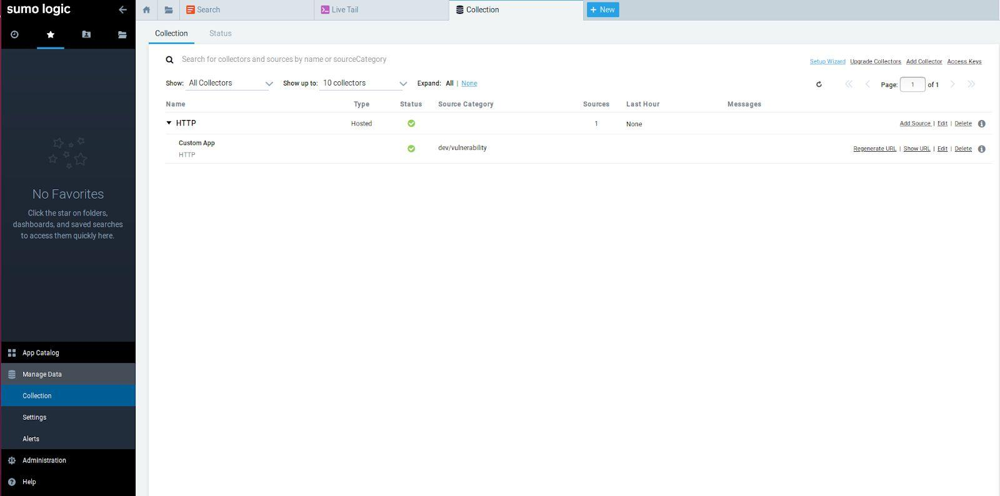
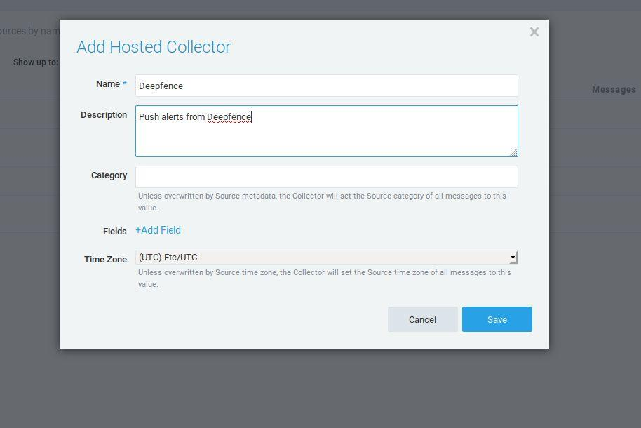
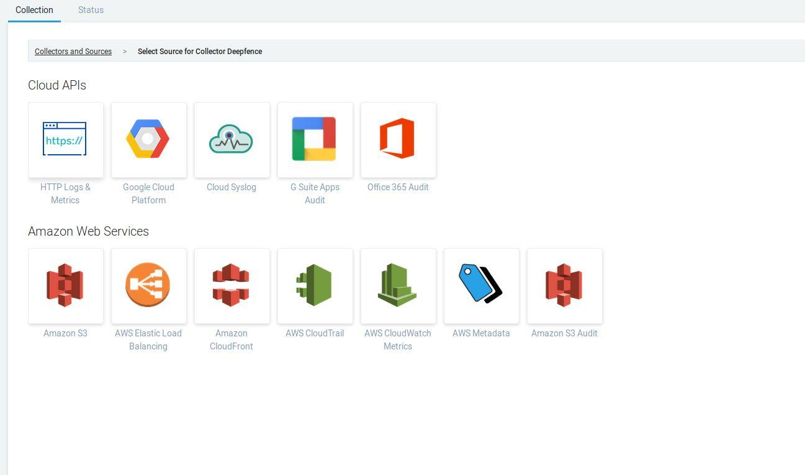
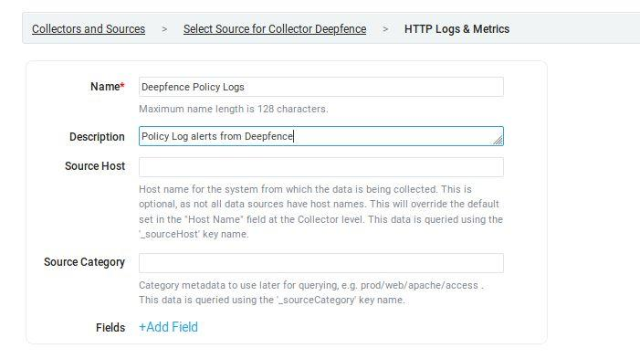
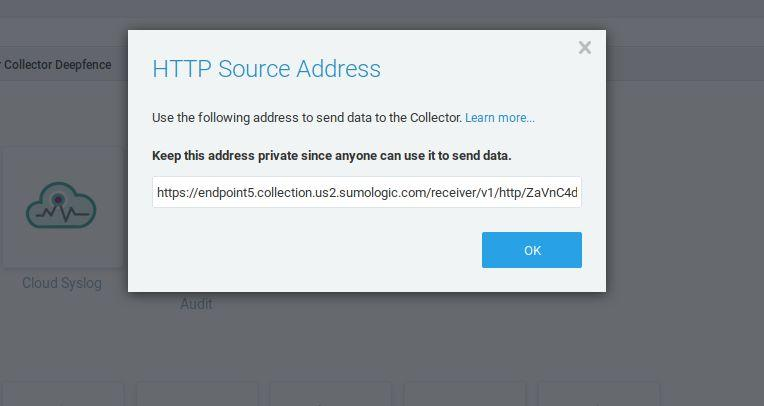

# ThreatMapper and Sumo Logic

ThreatMapper raises notifications to Sumo Logic using Sumo Logic collectors.

## To Configure Sumo Logic Integration

1. Under “Manage data”, navigate to “Collection”

   

2. Click on “Add Collector” and select “Hosted Collector”

   

3. Fill in the details and save the new collector

   

4. Choose to add “Source” to the newly created collector and choose “HTTP Logs & Metrics”

   

5. Fill in the Source details and click save

   

6. Paste the URL displayed on to Deepfence Sumo Logic integration page

   
