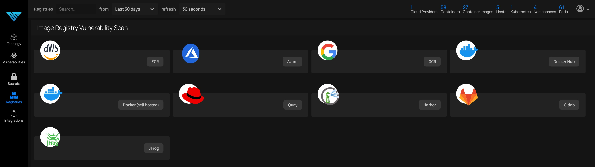
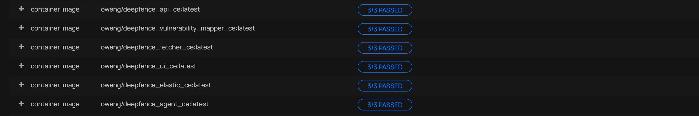

# Scanning Registries

ThreatMapper can scan container registries, on-demand or on a regular schedule.  This enables you to catch vulnerabilities in applications that are staged for production.

## Scanning Registries

Select the appropriate registry type, and **+ Add Registry**.  The credentials for each registry depends on the registry type; for example, to connect to a DockerHub Registry, use the following details:

ThreatMapper will index the artifacts in the Registry.  You can scan them manually, and you can define a periodic schedule to scan.  Results can be found on the **Vulnerabilities** report, and will be raised through any configured notifications.

