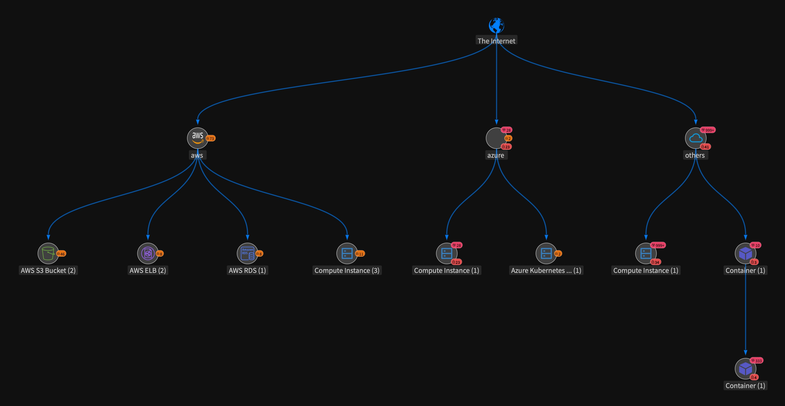
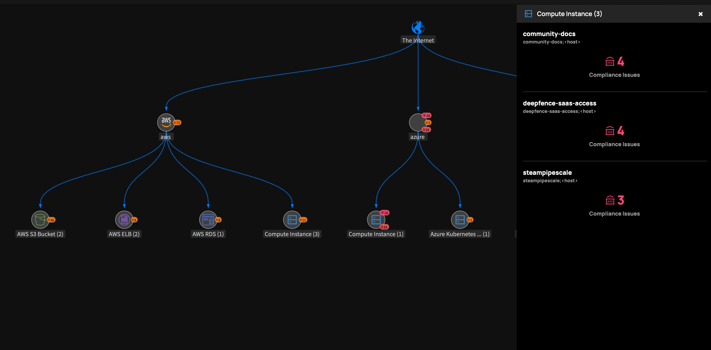
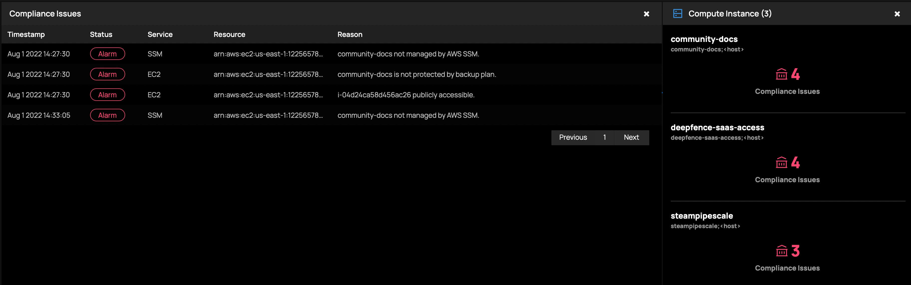

# The Threat Graph

The Threat Graph visualization provides an interactive view of your cloud and infrastructure assets, and the compliance status or each.

|  |
| :--: |
| Threat Graph |

You can view the assets assocuiated with each cloud instance and type:

|  |
| :--: |
| Threat Graph - View Assets |

Select an asset to list the compliance issues detected against that asset:

|  |
| :--: |
| Threat Graph - Investigate Compliance Issues |

