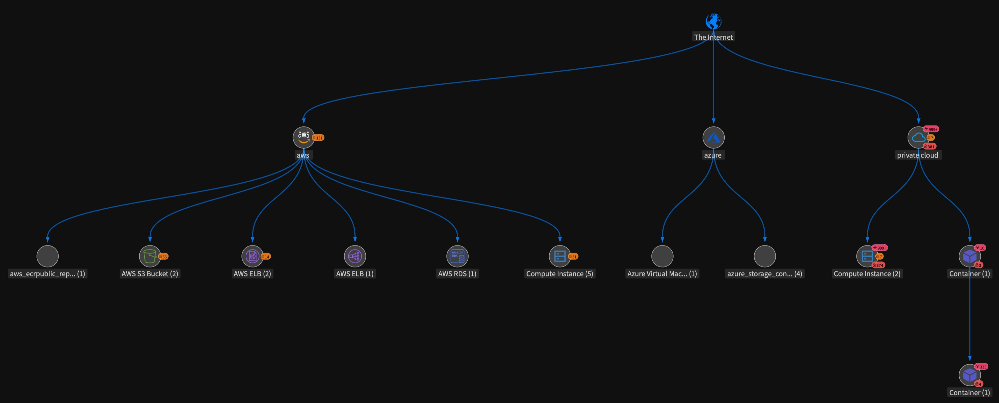
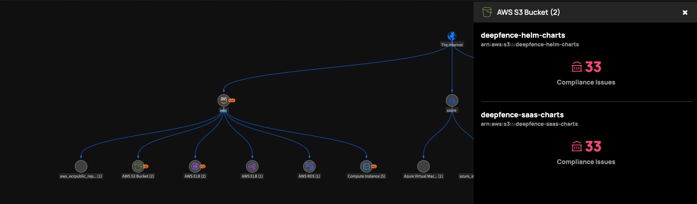
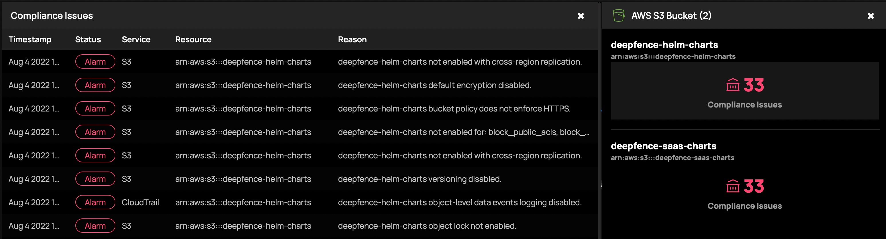

# The Threat Graph

The Threat Graph visualization provides an interactive view of your entire threat landscape. It presents the threats exposed on each node - vulnerabilities, secrets and compliance issues - and displays the connections between each based on live and recent network flows:

|  |
| :--: |
| Threat Graph |

In the graph visualization, nodes depict critical workloads and services that either have exploitable vulnerabilities or misconfigurations. Edges denote potential paths that attackers could take to access and exploit those issues, informed by real network data.

The complete threat landscape is rendered as an interactive and actionable graph.

You can view the assets associated with each workload or service type:

|  |
| :--: |
| Threat Graph - View Assets |

Threat Graph correlates the scan results (vulnerabilities, cloud misconfigurations, secrets) with runtime context (live network flows, security groups, live status) to contextualize and prioritize the alerts for each asset. 

Select an asset to list the issues detected against that asset:

|  |
| :--: |
| Threat Graph - Investigate Compliance Issues |

You can quickly narrow down from potentially thousands of alerts to a refined and accurate set of issues and attack paths that you can fix.