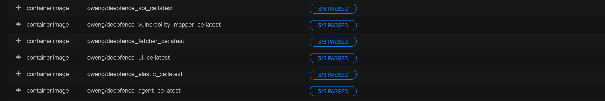

# Scanning Registries

You can scan for vulnerabilities in images stored in AWS ECR, Azure Container Registry, Google Cloud Container Registry, Docker Hub, Docker Self-Hosted Private Registry, Quay, Harbor, Gitlab and JFrog from the registry scanning dashboard.


## Add Registries

Select the appropriate registry type, and **+ Add Registry**.  The credentials for each registry depends on the registry type; for example, to connect to a DockerHub Registry, use the following details:


ThreatMapper will index the artifacts in the Registry.  You can scan them manually, and you can define a periodic schedule to scan.  Results can be found on the **Vulnerabilities** report, and will be raised through any configured notifications.



More detailed instructions are as follows:

```mdx-code-block
import DocCardList from '@theme/DocCardList';
import {useCurrentSidebarCategory} from '@docusaurus/theme-common';

<DocCardList items={useCurrentSidebarCategory().items}/>
```