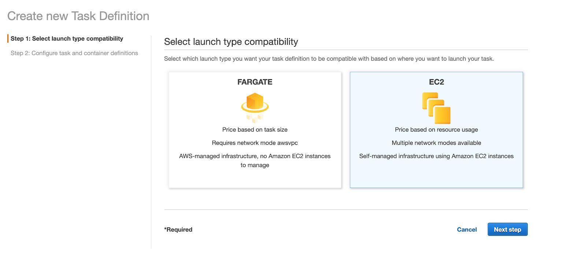
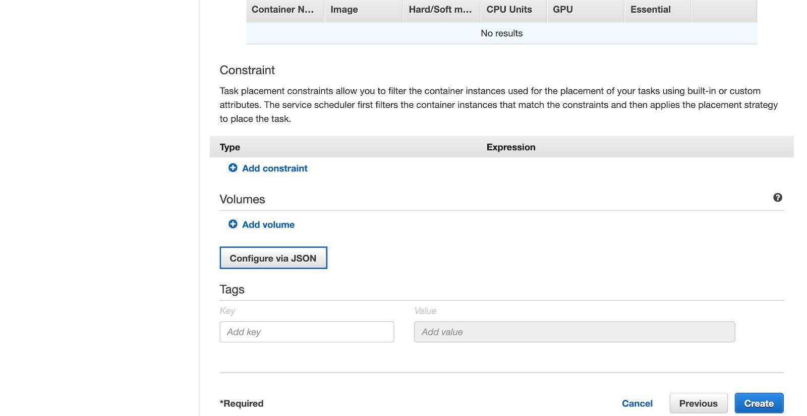
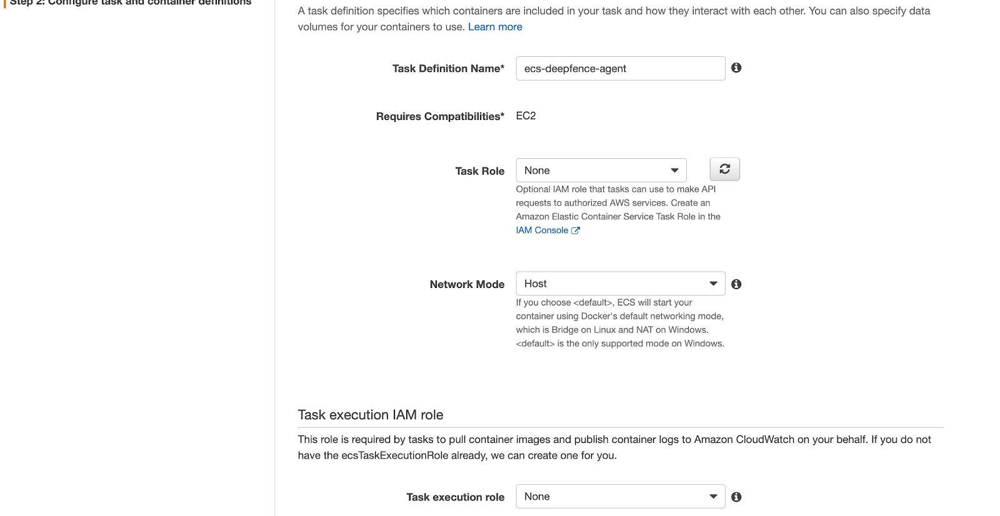
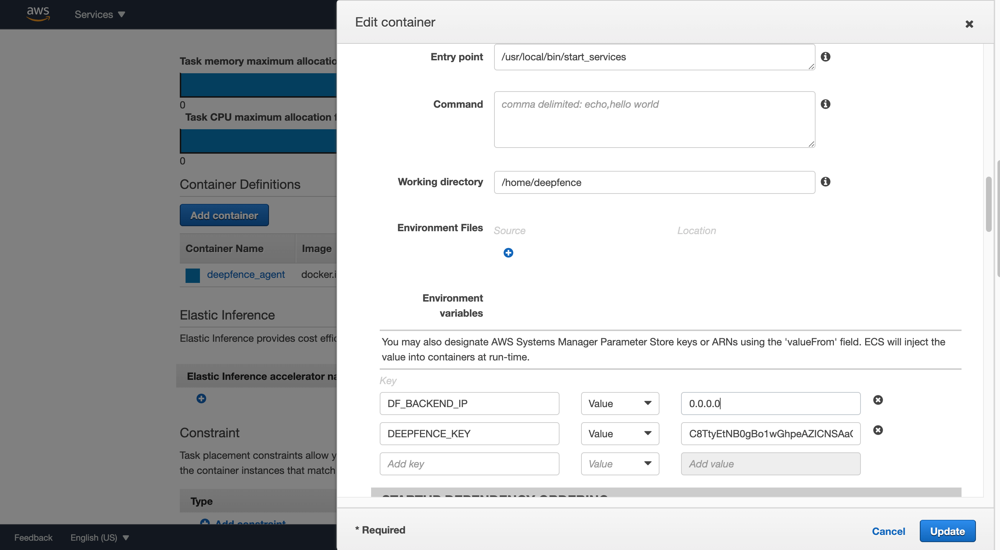
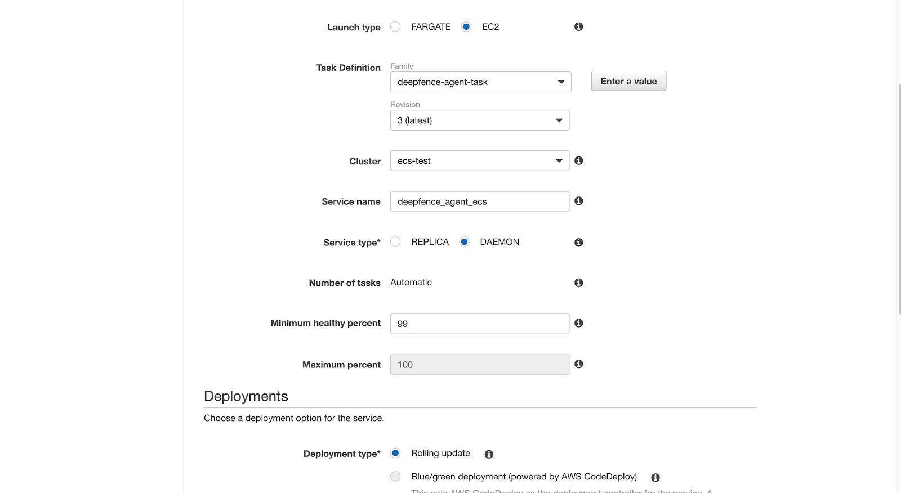

# Amazon ECS

In Amazon ECS, the ThreatMapper sensor agents are deployed as a daemon service using a task definition. Note that the ThreatMapper Management Console is deployed separately, outside the ECS cluster.

## Before you Begin

Grant IAM permissions for ECS task execution role to access this secret as outlined [here](https://aws.amazon.com/blogs/compute/introducing-private-registry-authentication-support-for-aws-fargate/).

## Create New Task Definition

1. Select EC2 launch type

2. Click “Configure via JSON”

3. Empty the contents and paste the contents of this [file](https://github.com/deepfence/ThreatMapper/blob/master/deployment-scripts/ecs_task_definition.json).

4. Edit “Task Definition Name”, “Task Role” and “Task Execution Role” according to your requirements.

5. Set image as `docker.io/deepfenceio/deepfence_agent_ce:latest`

6. Change the ip address “0.0.0.0” to the IP address of Deepfence Management Console.

7. In `DEEPFENCE_KEY` field, replace `C8TtyEtNB0gBo1wGhpeAZICNSAaGWw71BSdS2kLELY0` with your [API Key](Console-Initial-Configuration).

8. Save the task definition.

## Deploy Deepfence Agent Service

1. In your cluster, click “Create” button in “Service” tab.

2. Set launch type as EC2, service type as DAEMON, minimum healthy percent as 99

3. In the next page, set Load Balancer Type as None.

4. Set everything else to default values and save.
