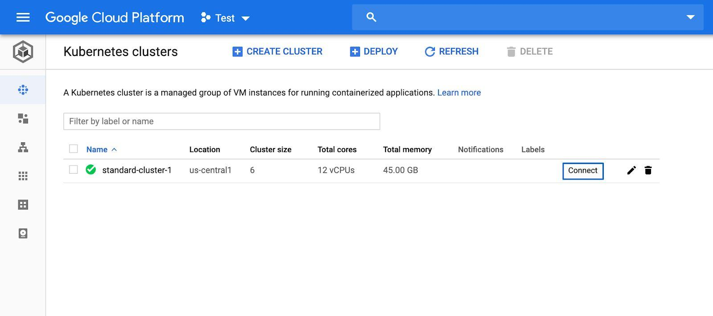
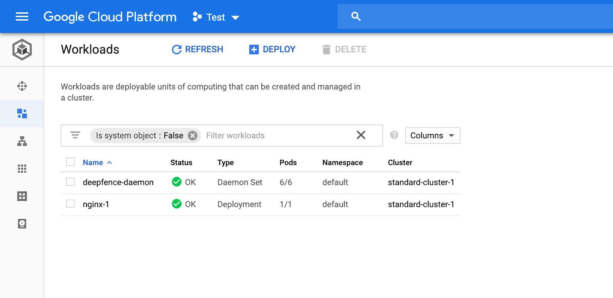

# Google GKE

In GKE, the ThreatMapper agents are deployed as a daemonset in the cluster.


## ThreatMapper Agents

### Connect to the Cluster

Connect to your GKE cluster using gcloud shell.

|  |
| :--: |
| *Connect to the Cluster* |

### Grant Permissions

Grant permissions for the installation with following command (required for k8s up to v1.11):

```bash
kubectl create clusterrolebinding "cluster-admin-$(whoami)" --clusterrole=cluster-admin --user="$(gcloud config get-value core/account)"
```

### Start the Deepfence Agent

Start deepfence agent (replace `x.x.x.x` with the IP address of the Management Console and `C8TtyEtNB0gBo1wGhpeAZICNSAaGWw71BSdS2kLELY0` with api key)

```bash
helm repo add deepfence https://deepfence-helm-charts.s3.amazonaws.com/threatmapper
helm show readme deepfence/deepfence-agent
helm show values deepfence/deepfence-agent

helm install deepfence-agent deepfence/deepfence-agent \
    --set managementConsoleUrl=x.x.x.x \
    --set deepfenceKey=C8TtyEtNB0gBo1wGhpeAZICNSAaGWw71BSdS2kLELY0 \
    --namespace deepfence \
    --create-namespace
```

:::tip

Optionally specify a named [tagged release](https://github.com/deepfence/ThreatMapper/releases):

```bash
helm install deepfence-agent deepfence/deepfence-agent \
    --set managementConsoleUrl=x.x.x.x \
    --set deepfenceKey=C8TtyEtNB0gBo1wGhpeAZICNSAaGWw71BSdS2kLELY0
    --set image.tag=1.4.0 --set image.clusterAgentImageTag=1.4.0 \
    --namespace deepfence \
    --create-namespace
```
:::

### Review the Workload Deployment

The ```deepfence-agent-daemon``` will be visible in Workloads page alongside other workloads in the cluster

|  |
| :--: |
| *Review the Workload Deployment* |
