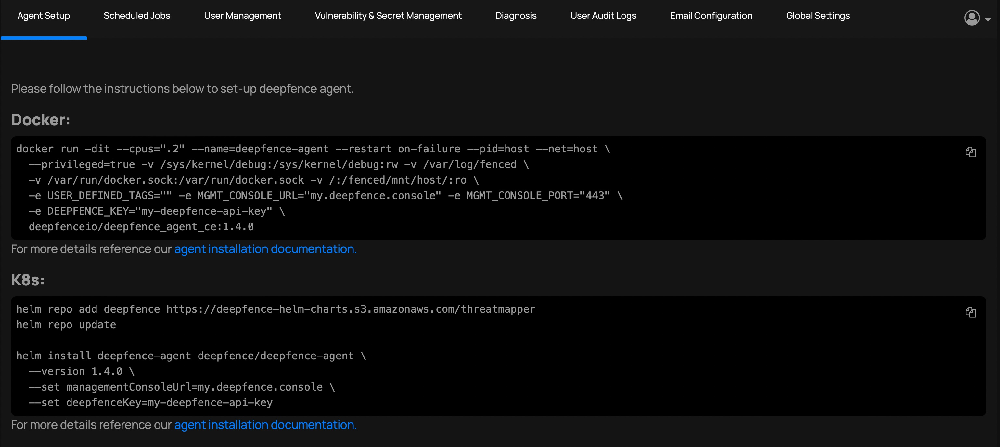

# The Role of ThreatMapper Sensors

Your production workloads are managed using ThreatMapper Sensors.  The ThreatMapper Sensors are implemented as lightweight, privileged containers which monitor activity, discover workloads and retrieve manifests.  They communicate with the ThreatMapper Management Console over TLS, using the URL and API key.

A single ThreatMapper Console can manage multiple workload types, and on-premise and cloud deployments simultaneously.

## Before You Begin

Before you install the Sensors, obtain the Management Console URL and API key as described in the [Initial Configuration](/threatmapper/console/initial-configuration).

You should take care to install the sensor version that matches your Management Console version, as compatibility across versions is not guaranteed.

Review the architecture for the Sensor Agent, as described in [Architecture: Sensor Agent container](/threatmapper/architecture/sensors).

Review the requirements for the Sensor Agent container, as described in [System Requirements](/threatmapper/architecture/requirements).

## Installing the ThreatMapper Sensors

For your convenience, the ThreatMapper management console provides the default installation commands to install the agent on a docker host or in a kubernetes cluster:

||
| :--: |
| Default Agent Setup (URL and Key masked) |

More detailed instructions are as follows:

```mdx-code-block
import DocCardList from '@theme/DocCardList';
import {useCurrentSidebarCategory} from '@docusaurus/theme-common';

<DocCardList items={useCurrentSidebarCategory().items}/>
```