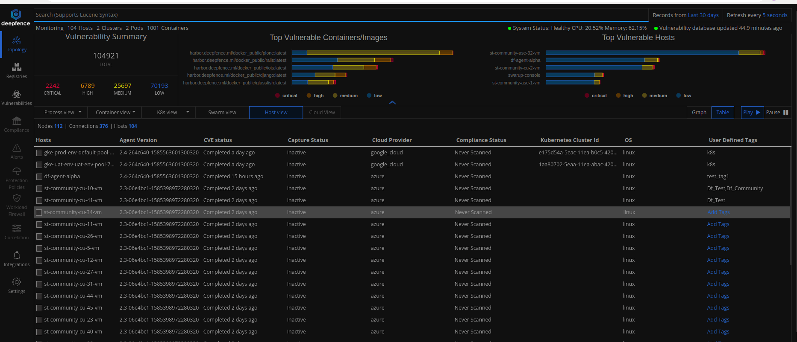
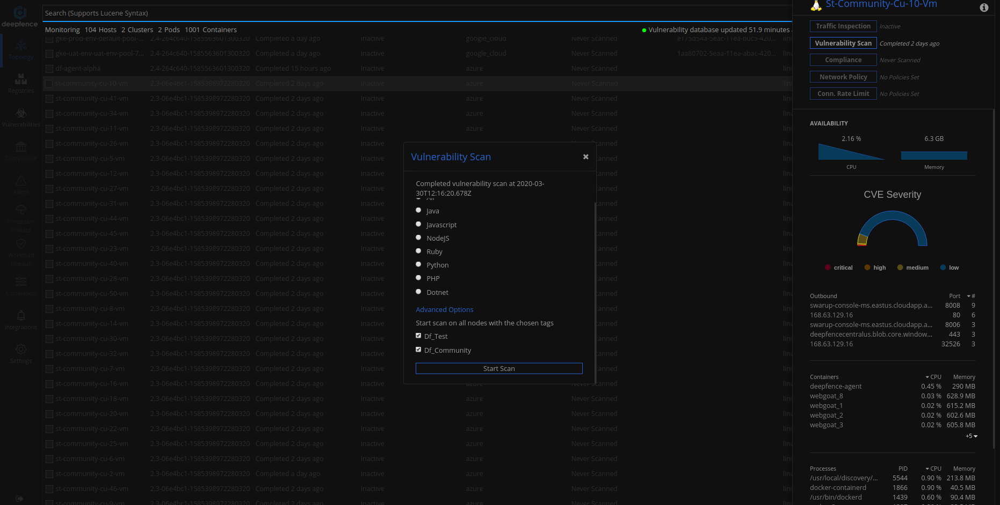

# Vulnerability Scanning using Tags

Users can tag individual nodes and run vulnerability scans on a subset of nodes using these user-defined tags as explained below.

1. Users can go to table view and click on the *User Defined Tags* column to tag a node as shown in the following picture. It is possible to assign multiple tags to a node. 

    

2. While running vulnerability scans,  users can select user defined tags to run the scan on a subset of nodes corresponding to the selected tags as shown in the following picture.

    
