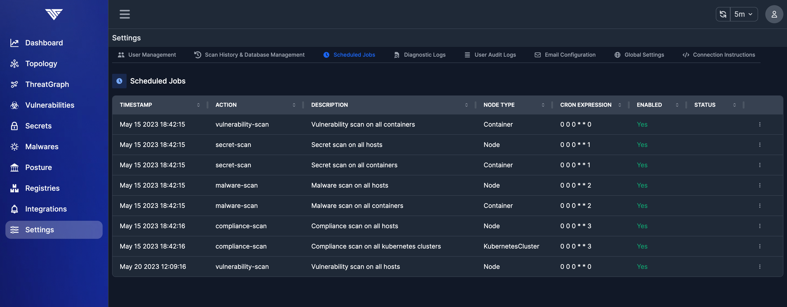

# Automating Scans

## Why should you Automate Production Scans?

Vulnerabilities may be introduced into your production platforms at any point.  And change to application dependencies of infrastructure may introduce new vulnerabilities.  Changes in the application topology, such as promoting a service from internal dev traffic to external Internet traffic, can change ThreatMapper's risk-of-exploit score for a vulnerability.

Most significantly, new vulnerabilities can be discovered in existing components at any time.  A component that passed all vulnerability scans when it was deployed may still contain issues that are discovered weeks, months or years afterwards.

ThreatMapper can scan your production platforms periodically, using the most up-to-date threat feeds at each time.  This enables ThreatMapper to catch changes in application components and topology, and to find recently-disclosed vulnerabilities in components that are already deployed.


## Automating ThreatMapper

The results of automated scans are added to the **Vulnerability Scans** report, and can be raised through any configured [Notification](/docs/integrations) method.

ThreatMapper presents a series of APIs that you can use to enumerate nodes and run scans:

```
https://<CONSOLE_URL>/deepfence/swagger-ui/
https://<CONSOLE_URL>/deepfence/openapi.json
```

### Scanning Workloads before Deployment

ThreatMapper can be invoked during the build process for a workload, commonly referred to as CI (Continuous Integration).  For more information, check out the (Scanning in the CI Pipeline)[Scan-CI] documentation.

ThreatMapper can scan registries, looking for vulnerabilities in containers.  Scans can be invoked manually, or can run periodically against the registry.  For more information, check out the (Scanning Registries)[Scanning Registries] documentation.

### Use Case: Periodically Running Scans ("cron")

#### UI
Schedule is set by default in ThreatMapper to scan all containers and hosts once a week. They can be enabled if needed.



#### API
A good example for API-driven automation - you can create a script that enumerates your infrastructure and workloads, and then scans on-demand.


### Use Case: Scanning Nodes before Deployment

You can use ThreatMapper to scan new nodes as they are added to the infrastructure, and can prevent these nodes from becoming active if they fail the scan:
 * Instance is started by elastic platform e.g. AWS 
 * Instance contains ThreatMapper agent as a component
 * When instance starts, agent self-registers with management console.  
 * Management console notices a new instance has been added and schedules a scan (using streaming API - details to be documented)
 * Once the scan has completed, if it is deemed to have failed (admin defines pass or fail criteria), the management console can delete the new node (using preconfigured credentials)

