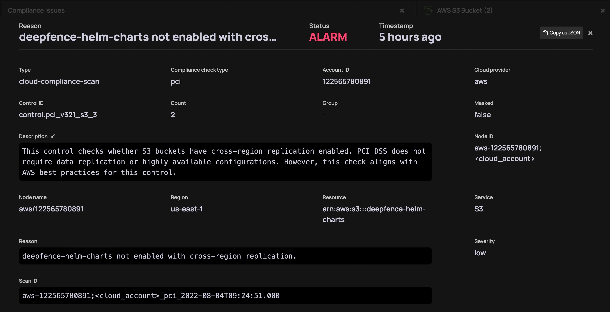
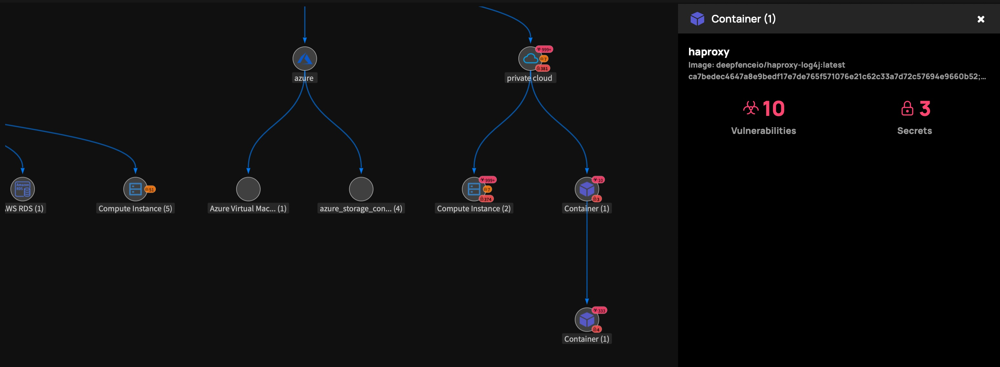

# Understanding the Threat Graph

The Threat Graph visualization provides an interactive view of your entire threat landscape. It presents the threats exposed on each node - vulnerabilities, secrets and compliance issues - and displays the connections between each based on live and recent network flows.

|  |
| :--: |
| Threat Graph |

Nodes depict critical workloads and services that either have exploitable vulnerabilities or misconfigurations. Edges denote potential paths that attackers could take to access and exploit those issues, informed by real network data.

The complete threat landscape is rendered as an interactive and actionable graph. The graph correlates the scan results (vulnerabilities, cloud misconfigurations, secrets) with runtime context (live network flows, security groups, live status) to contextualize and prioritize the alerts for each asset. 

## Investigating the Threat Graph landscape

View the Cloud or Platform nodes to gain a summary of the number of significant vulnerabilities, secret and compliance issues within each cloud or platform.

### Example: Cloud Compliance Issues

Select a cloud asset type, such as an S3 bucket, to view the instances of that asset.

|  |
| :--: |
| Threat Graph - View Assets |

Select an instance of that asset type to list the issues detected against instance:

|  |
| :--: |
| Threat Graph - Investigate Compliance Issues |

Select an issue to understand the full nature of the compliance deviation:

|  |
| :--: |
| Threat Graph - View Compliance Issue |

You can quickly narrow down from potentially thousands of alerts to a refined and accurate set of issues and attack paths that you can fix.

## Example: Workload Issues

Select a runtime workload, such as an 'haproxy' container, to list the issues detected against that asset:

|  |
| :--: |
| Threat Graph - Investigate Workload Issues |

You can then review the issues detected against that workload.

|  |
| :--: |
| Threat Graph - View Vulnerabilities |

If needed, you can drill down to the vulnerability specifics:

|  |
| :--: |
| Threat Graph - View Vulnerability Specifics |

Once again, the Threat Graph enables you to quickly narrow down from potentially thousands of alerts to a refined and accurate set of issues and attack paths that you can fix.
