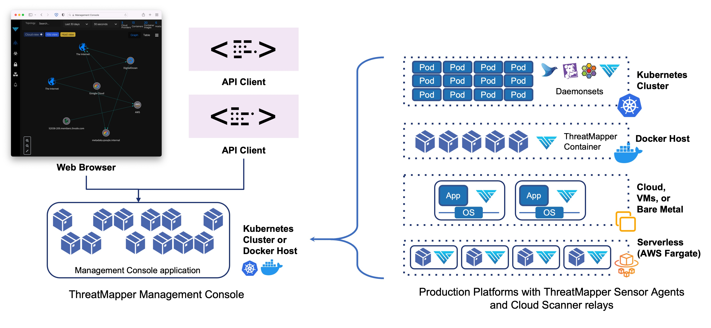

# ThreatMapper Architecture

The ThreatMapper product consists of a Management Console, and multiple Sensor Agents and Cloud Scanner tasks that are deployed within your production platform(s).

The Management Console is deployed first. The Management console generates an API key and a URL which you will need when you install the Sensor containers and Cloud Scanner tasks.

The Management Console is managed over TLS (port 443), used for administrative traffic (web browser and API) and for sensor traffic.  You should firewall or secure access to this port so that only authorised admin users and remote production platforms are able to connect.

# Agent-Less and Agent-Based operation

ThreatMapper uses both agent-less and agent-based operations to discover the widest-possible range of threats and render them in 'Threat Graphs' and 'Threat Maps'. You can use either or both operations, and can configure their access to your production and non-production systems in line with your own security posture.

|                | Agent-Less (Cloud Connector)                                                                                         | Agent-Based (Sensor Agent)                                                                                                 |
|----------------|----------------------------------------------------------------------------------------------------------------------|----------------------------------------------------------------------------------------------------------------------------|
| Implementation | Direct access to infrastructure APIs, using a secured **Cloud Connector** task, deployed local to the cloud instance | Lightweight, privileged **sensor agent** container with access to local resources on the host                              |
| Visibility     | Cloud configuration and assets, as exposed through cloud or infrastructure API                                       | Local assets, including filesystem, process list, local containers and pods, and kernel interfaces                         |
| Capability     | Identifies deviation from good practice configuration ("Compliance Scanning") for cloud platforms                    | Identifies network flows and performs vulnerability, secret and local host (Linux/Kubernetes) compliance scanning          |
| Output         | Agent-less data is reported in the 'Threat Graph', which shows compliance-related issues                             | Agent-based data is reported in the Threat Map (for vulnerabilities, secrets etc) and Threat Graph (for compliance issues) |

