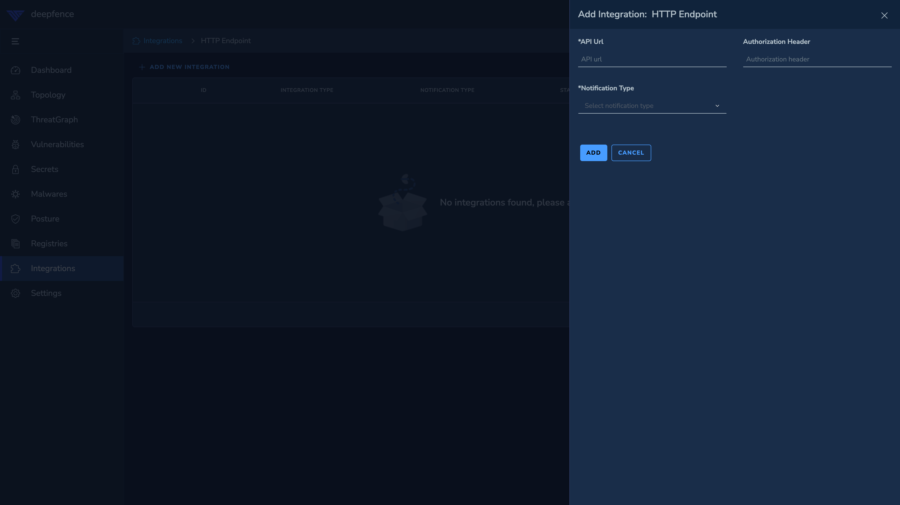

# HTTP Endpoint

*Forward notifications to http endpoint*

Example http endpoint: http://10.3.16.2:8080

Optionally authentication http header value can be set, if the api server requires authentication.
