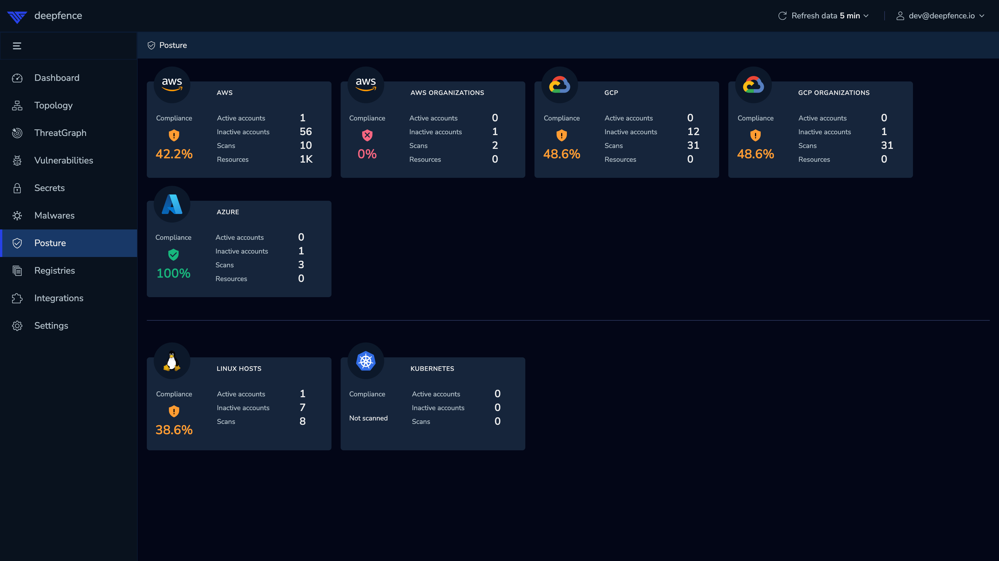
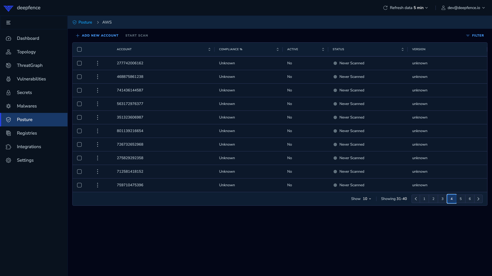
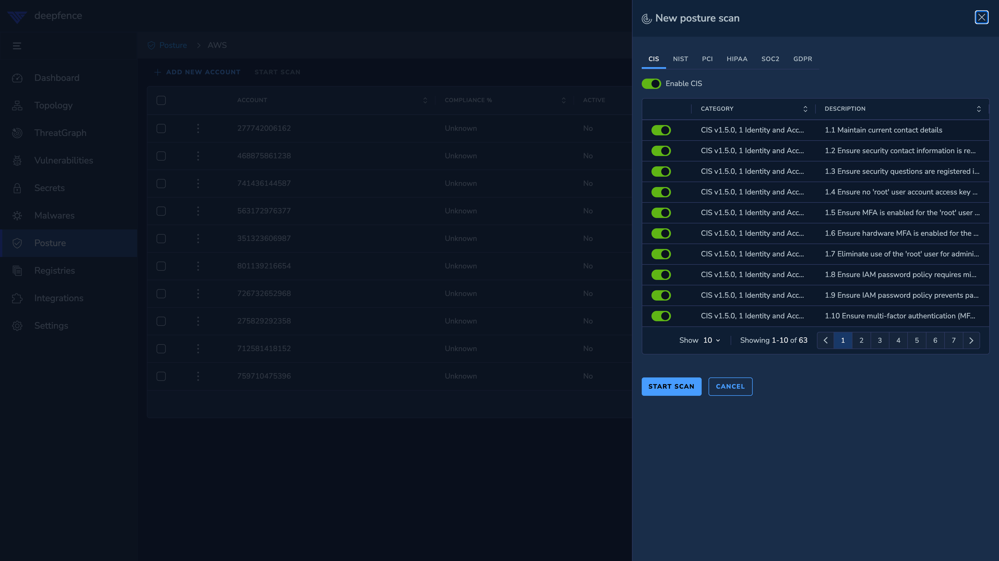
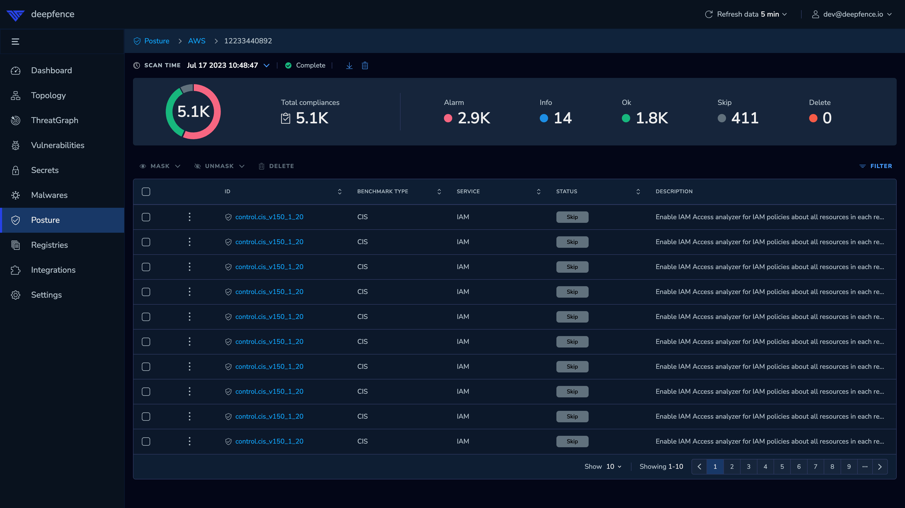

# Compliance Posture Scanning

Once the ThreatMapper management console has been deployed, and you have configured one or more targets for compliance posture scanning, you can then scan those targets against various compliance benchmarks.

ThreatMapper measures the level of compliance, and presents the overall compliance picture as a 'Threat Graph'.  The Threat Graph  shows how the platforms are exposed, the routes that an attacker may take to exploit the exposure.

## Understanding Compliance Scanning

### Controls

Compliance Posture scanning builds on a large library of **controls** - these are specific requirements and matching tests.  For example, for AWS you will find controls that correspond to best-practice configurations of S3 buckets, such as enabling TLS access and blocking plain-text HTTP. For a Linux host, you will find controls relating to the configuration of the system clock.

### Benchmarks

Controls are grouped into **benchmarks**. Benchmarks are formal standards of compliance defined by industry bodies; they may represent best practice such as CIS, or they may represent specific industry requirements such as HIPAA or PCI DSS.

Benchmarks are an important tool for demonstrating compliance when facing an audit by an industry body.  They also represent best practice for a range of scenarios, and should be run regularly as pre-production and in-production tests to identify serious configuration errors that may result in exposure to exploit.

You can test individual benchmarks, or you can combine a test (scan) to include several benchmarks.  Where controls are used by multiple benchmarks, ThreatMapper will only run them once and apply the result to each benchmark.

The benchmarks available vary by cloud provider:

| Benchmark | AWS | Azure | GCP | Kubernetes Host | Linux Host |
|-----------|-----|-------|-----|-----------------|------------|
| CIS       | Y   | Y     | Y   |                 |            |
| GDPR      | Y   |       |     | Y               | Y          |
| HIPAA     | Y   | Y     |     | Y               | Y          |
| PCI-DSS   | Y   |       |     | Y               | Y          |
| SOC-2     | Y   |       |     |                 |            |
| NIST      | Y   | Y     |     | Y               | Y          |

## Start a Scan

Begin on the **Posture** page in the ThreatMapper console.

Select a cloud instance that you have [configured previously](/docs/cloudscanner/).  You may have several instances of a given cloud type:

|  |
|:---------------------------------------------------------------:|
|                         Select a Cloud                          |

|  |
|:---------------------------------------------------------------:|
|             Select target for Cloud Compliance Scan             |

If you want to scan a host (Linux host or Kubernetes master or slave node), ensure that the [threatmapper sensor](/docs/sensors) is deployed on that host.

Select the compliance benchmarks you wish to run on the target cloud instance or host:

|  |
|:------------------------------------------------------------------------:|
|                  Select benchmarks for  Compliance Scan                  |

You can preview the controls that will be run for each benchmark, and you can select an action to mask (or unmask) specific controls.

Click **Start Scan** once you have completed your selection. The Cloud Connector or Sensor Agent will then perform the scan and in due course, will submit the results to your ThreatMapper console.

## Inspecting Scan Results

When scans complete, they are reported on the **Posture** page in the ThreatMapper console.

Select the appropriate cloud instance and choose to view the results or review the inventory.

### View Scan Results

ThreatMapper presents the recent scan results, filtered by benchmark, with a broad 'compliance score' for each.  The compliance score is the percentage of "OK (pass)" and "Info (manual verification required)" results.

Select an individual scan run (result), and optionally filter the results by service (e.g. IAM, CloudWatch) and/or status.

|  |
|:---------------------------------------------------------------------:|
|                View the Results for a Compliance Scan                 |

If you judge that a result is not applicable in your specific circumstances, you can mask that result out.  That result will not be reported in subsequent scans.
