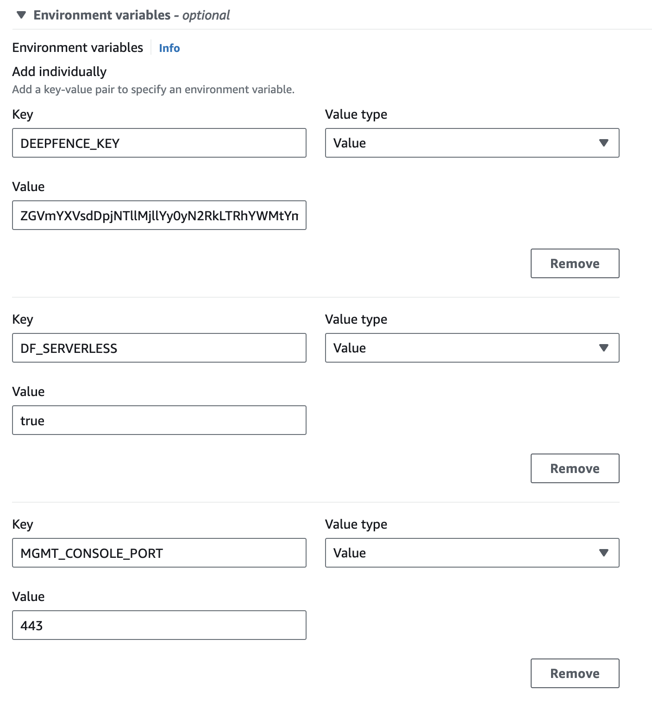
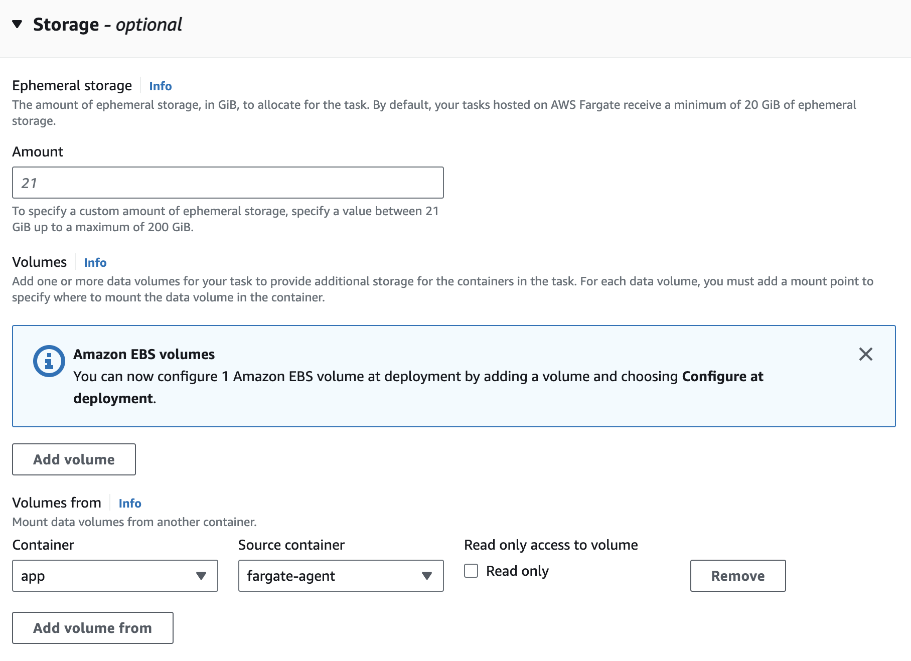

# AWS Fargate

_Deployed as a sidecar container using a task definition_

In AWS Fargate, the ThreatMapper agents are deployed as a sidecar container using a task definition.

The ThreatMapper management console is installed separately outside the fargate and the installation procedure is the same as before.

:::note
Currently supported base operating systems of containers are Amazon Linux, Ubuntu, Debian, CentOS and RHEL
:::

:::note
Please note the agent image "quay.io/deepfenceio/deepfence_agent_ce:2.2.2-fargate" is different from other deployment methods.
:::

## Installing on AWS Fargate

1. Set up AWS ECS by following the steps outlined here: [Set up to use AWS ECS](https://docs.aws.amazon.com/AmazonECS/latest/developerguide/get-set-up-for-amazon-ecs.html)

2. Refer [Prerequisites](./aws-fargate.md#prerequisites) for the actions performed in this step.

   You'll need to perform the following steps:

    1. Create an _AWS ECS task execution IAM role_.
    1. Create a secret to store Deepfence Key.
    1. Create policies (either managed or inlined policy) allowing access to your stored secrets and attach the created policies to the task IAM role. You also need to attach the _AmazonECSTaskExecutionRolePolicy_ to the IAM role to run AWS ECS tasks.

3. Click on the task definition on the side panel to create a new task definition. Select "AWS Fargate" as launch type

   Use the following steps outlined below in **"Fargate Task definition And Deployment"** instructions to deploy the fargate agent.

   You can configure the task definition either through JSON or using the AWS UI.

4. Deploy your application on your cluster.

## Create New Task Definition in Fargate

### Create Task Definition

Click Create new Task Definition and select "AWS Fargate" as launch type.

|  |
| :--------------------------------------------: |
|               _New Fargate Task_               |

### Set Task Parameters

Edit the _Task Definition Name_, _Task Role_ and _Task Execution Role etc_. as required. For the _Task Role_ and _Task Execution Role_, you have to use the role created in _IAM role creation step_ earlier. Specify _Task memory_ and _Task CPU_ according to your Requirements.

|  |
| :-----------------------------------------------------------------------------: |
|               _Update task definition and create agent container_               |

### Add the Deepfence Agent Sidecar Container

Click on the _Add Container_ button to create a standard container for the ThreatMapper agent. Set image as _**quay.io/deepfenceio/deepfence_agent_ce:2.2.2-fargate**_

In the environment section, **DO NOT** mark it as essential.

You need to note down the name of the agent container (_deepfence-agent_ in our example), which you will have to specify in _Volumes From_ section in application container task definition section later.

Finally, click the _Add_ button to create the deepfence agent container:

|  |
| :---------------------------------------------------------------------------------: |
|           _Create the Sidecar Agent Container inside the Task Definition_           |

### Add the Main Container to your Application

Click on the _Add Container_ button to create a new container for your application by following the additional steps outlined below. If you have more than one application container, you will have to repeat these steps for each container.

#### Configure Environment Variables for Fargate Application Container

The following environment variables are required for the ThreatMapper agent:

- **DEEPFENCE_KEY**: API key available in the management console UI(can be stored as a secret and later referred in environment using valuesFrom)
- **MGMT_CONSOLE_URL**: IP address of Management Console
- **DF_SERVERLESS**: Set to _true_ for serverless instances
- **MGMT_CONSOLE_URL_SCHEMA**: Set to _http_ or _https_ depending on the schema used for management console
- **MGMT_CONSOLE_PORT**: Set to _80_ or _443_ depending on the port used for management console

|  |
| :-----------------------------------------------------------------------------------------------: |
|               _Configuring Environment Variables for Fargate Application Container_               |

If you are using json to configure your task definitions, you can use the following part in the appropriate container section of task definition json after copying the appropriate IP address and API Key.

```
"environment": [
    {
        "name": "DEEPFENCE_KEY",
        "value": "<deepfence-key>"
    },
    {
        "name": "MGMT_CONSOLE_URL",
        "value": "<MGMT_CONSOLE_URL>"
    },
    {
        "name": "DF_SERVERLESS",
        "value": "true"
    },
    {
        "name": "DF_LOG_LEVEL",
        "value": "info"
    },
    {
        "name": "USER_DEFINED_TAGS",
        "value": ""
    },
    {
        "name": "DF_INSTALL_DIR",
        "value": "/path/to/custom/install/dir"
    },
    {
        "name": "MGMT_CONSOLE_URL_SCHEMA",
        "value": "https"
    },
    {
        "name": "MGMT_CONSOLE_PORT",
        "value": "443"
    }
]
```

#### Configure Storage

Scroll down to **Storage** Section and click **Add Volume from**. In the **Container** dropdown select your application container and in **Source container** dropdown select the agent container to allow read/write from deepfence agent volume. Leave the _Read only_ button **unchecked** as shown below.

|  |
| :--------------------------------------------------------------: |
|                 _Configure VolumesFrom Setting_                  |

If you are using json to configure your task definitions, you can copy the following settings to the appropriate container section of the json after changing the Container name:

```
"volumesFrom": [
   {
       "sourceContainer": "deepfence-agent",
       "readOnly": false
   }
],
```

Finally, click the Create button to create the task definition for the deployment.

### Configure Correct Startup

Now that deepfence agent is available in the fargate instance, you need to invoke agent and application entrypoints to start the application with Deepfence enabled. This can be done in two ways:

#### Edit the Entry Point for the container

There are two ways to achieve this:

**Change the Entrypoint**: For this, you need to provide the ThreatMapper entrypoint and the Application entrypoint and arguments, as a comma delimited list in the **Entry point** field:

|  |
| :---------------------------------------------------------------------: |
|        _Method (1a): Invoking agent by changing the Entrypoint_         |

If you are using json to configure your task definitions, then you can specify the entrypoint and/or command as follows using appropriate quoting:

```
"entryPoint": [
   "/deepfence/usr/local/bin/deepfence-entry-point-scratch.sh",
   "customer-entry-point.sh",
   "param1",
   "param2"
]
```

**Change the Entrypoint and Command**: Alternatively, you can provide the ThreatMapper entrypoint in the **Entry point** field and the Application entrypoint and arguments in the **Command** field as shown below:

|  |
| :---------------------------------------------------------------------------------------: |
|        _Method (1b): Invoking agent by changing the Entrypoint and Command field_         |

If you are using json to configure your task definitions, then you can specify the entrypoint and/or command as follows using appropriate quoting:

```
"entryPoint": [
   "/deepfence/usr/local/bin/deepfence-entry-point-scratch.sh"
],
"command": [
   "customer-entry-point.sh",
   "param1",
   "param2"
]
```

## Prerequisites

Make sure you have the following information:

- Management console URL/IP, later referred as `<MGMT_CONSOLE_URL>`
- Deepfence API key, later referred as `<DEEPFENCE_KEY>` (This key can be found from the management console, in the settings > User > API Key)

1. Add secret for Deepfence API key
    - Go to the secret manager dashboard from the AWS Console
    - Select "Store a new secret"
    - Select "Other type of secret"
    - Select "Plaintext" and paste the following:
      ```json
      {
        "deepfence_api_key": "<DEEPFENCE_KEY>"
      }
      ```

Create the secret and store the ARN. We will refer to it as `<API_KEY_SECRET_ARN>`

:::caution
Be careful with the double quotes, sometimes the AWS UI transforms them into a special character that is not recognized as valid JSON.
:::

2. Create a new role (e.g.: `deepfence-agent-role`)
    - Go to the IAM dashboard from AWS Console
    - Go to Access management > roles
    - Select "Create Role",
    - Select "Custom trust policy"
    - Paste the following:
      ```json
      {
        "Version": "2012-10-17",
        "Statement": [
          {
            "Effect": "Allow",
            "Principal": {
              "Service": "ecs-tasks.amazonaws.com"
            },
            "Action": "sts:AssumeRole"
          }
        ]
      }
      ```

Then continue:

    - Search in the "Permissions policies" for "Task" > Select the following policy: `AmazonECSTaskExecutionRolePolicy`
    - Again search in the "Permissions policies" for "Task" > Select the following policy: `CloudWatchLogsFullAccess`
    - Click "Next", name the role `deepfence-agent-role`, then "Create role"
    - Store the Role ARN. We will refer to it as `<AGENT_TASK_ROLE_ARN>`
    - Search for your newly created role
    - Click on it (`deepfence-agent-role` in our example)
    - Select "Add permissions" > "Create inline policy" and add:
        ```json
        {
            "Version": "2012-10-17",
            "Statement": [
                {
                    "Effect": "Allow",
                    "Action": [
                        "secretsmanager:GetSecretValue"
                    ],
                    "Resource": [
                        "<API_KEY_SECRET_ARN>"
                    ]
                }
            ]
        }
        ```

    - If you are using a custom KMS key for your secrets and not using the default key, you will also need to add the KMS key permissions to your inline policy:

      ```json
      {
          "Version": "2012-10-17",
          "Statement": [
              {
                  "Effect": "Allow",
                  "Action": [
                      "kms:Decrypt",
                      "secretsmanager:GetSecretValue"
                  ],
                  "Resource": [
                      "<API_KEY_SECRET_ARN>",
                      "<custom_kms_key_arn>"
                  ]
              }
          ]
      }
      ```

Then create the new policy.

## Sample fargate task definition json with deepfence-agent sidecar

```json
{
  "requiresCompatibilities": ["FARGATE"],
  "inferenceAccelerators": [],
  "containerDefinitions": [
    {
      "name": "python",
      "image": "python:latest",
      "cpu": 0,
      "portMappings": [
        {
          "name": "python-8000-tcp",
          "containerPort": 8000,
          "hostPort": 8000,
          "protocol": "tcp"
        }
      ],
      "essential": true,
      "entryPoint": [
        "/deepfence/usr/local/bin/deepfence-entry-point-scratch.sh"
      ],
      "command": ["python3", "-m", "http.server"],
      "environment": [
        {
          "name": "MGMT_CONSOLE_URL",
          "value": "<MGMT_CONSOLE_URL>"
        },
        {
          "name": "DF_SERVERLESS",
          "value": "true"
        },
        {
          "name": "DF_LOG_LEVEL",
          "value": "info"
        },
        {
          "name": "USER_DEFINED_TAGS",
          "value": ""
        },
        {
          "name": "DF_INSTALL_DIR",
          "value": "/usr/local/bin"
        },
        {
          "name": "MGMT_CONSOLE_URL_SCHEMA",
          "value": "https"
        },
        {
          "name": "MGMT_CONSOLE_PORT",
          "value": "443"
        }
      ],
      "mountPoints": [],
      "volumesFrom": [
        {
          "sourceContainer": "deepfence-agent",
          "readOnly": false
        }
      ],
      "secrets": [
        {
          "name": "DEEPFENCE_KEY",
          "valueFrom": "<API_KEY_SECRET_ARN>:deepfence_api_key::"
        }
      ],
      "logConfiguration": {
        "logDriver": "awslogs",
        "options": {
          "awslogs-create-group": "true",
          "awslogs-group": "/ecs/test-doc-python",
          "awslogs-region": "us-west-2",
          "awslogs-stream-prefix": "ecs"
        }
      }
    },
    {
      "name": "deepfence-agent",
      "image": "quay.io/deepfenceio/deepfence_agent_ce:2.2.2-fargate",
      "repositoryCredentials": {},
      "cpu": 0,
      "portMappings": [],
      "essential": false,
      "environment": [],
      "mountPoints": [],
      "volumesFrom": [],
      "logConfiguration": {
        "logDriver": "awslogs",
        "options": {
          "awslogs-create-group": "true",
          "awslogs-group": "/ecs/test-doc-python",
          "awslogs-region": "us-west-2",
          "awslogs-stream-prefix": "ecs"
        }
      }
    }
  ],
  "volumes": [],
  "networkMode": "awsvpc",
  "memory": "4096",
  "cpu": "2048",
  "family": "test-doc-python",
  "executionRoleArn": "<AGENT_TASK_ROLE_ARN>",
  "taskRoleArn": "<AGENT_TASK_ROLE_ARN>",
  "runtimePlatform": {
    "cpuArchitecture": "X86_64",
    "operatingSystemFamily": "LINUX"
  },
  "tags": [],
  "placementConstraints": []
}
```
