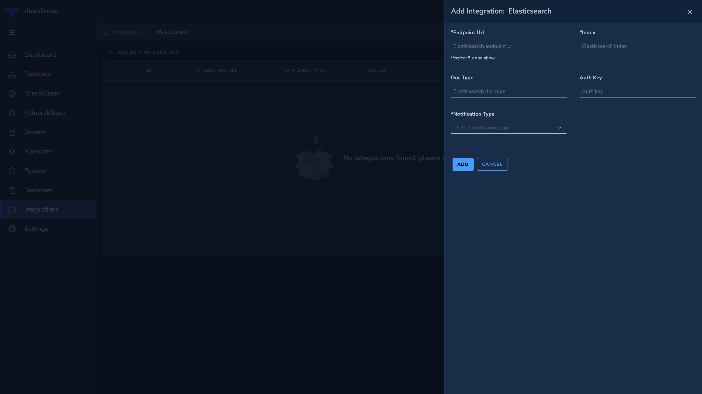

# Elasticsearch

*Forward Notifications to Elasticsearch*

### Configuration
1. Enter Elasticsearch endpoint url. (Example: http://10.108.0.2:9200)
2. Enter Elasticsearch index name.
3. Enter Elasticsearch doc type if version is 5.x. If version is 6 and above, enter `_doc` as doc type.
4. If authentication is enabled for the Elasticsearch instance, set the auth header.
5. If username is `demo` and password is `p@55w0rd`, generate basic auth header by running `echo -n '{username}:{password}' | base64` or generate online at https://www.base64encode.net
6. Enter auth header value as `Basic dXNlcm5hbWU6cGFzc3dvcmQ=`. If authorization is not enabled, leave it empty.
7. Choose the resource that has to be sent to Elasticsearch and click subscribe button to save.
