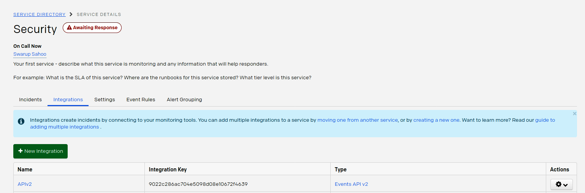
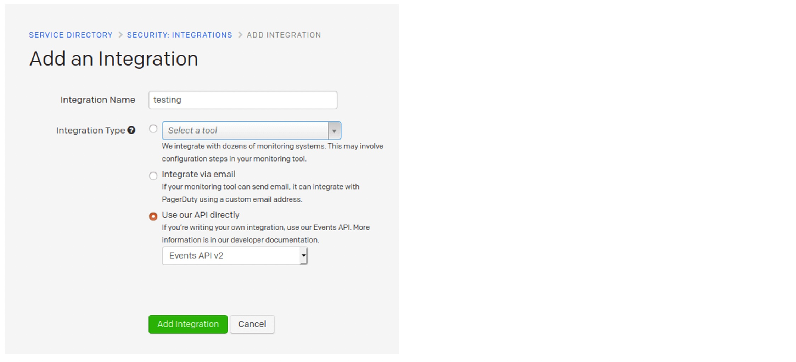
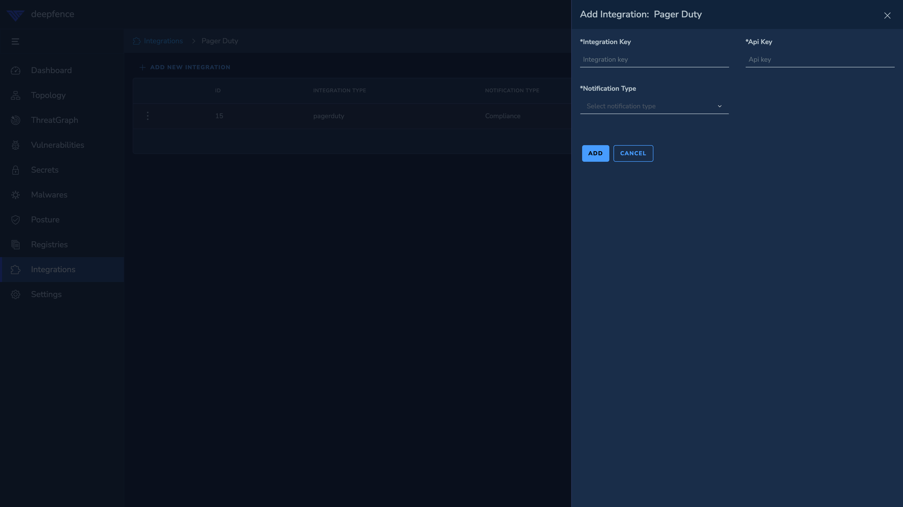

# ThreatMapper and PagerDuty

ThreatMapper raises notifications to PagerDuty using the PagerDuty API (v1 or v2).

## To Configure PagerDuty Integration

1. In the PagerDuty console, navigate to **Configuration** > **Services**. If you are creating a new service for your integration, click Add New Service. If you are adding your integration to an existing service, click the name of the service you want to add the integration to, go to the Integrations tab, then click New Integration as shown in the image below.

   

2. Next, create a new integration by selecting the appropriate API version as shown in the image below.

   

3. Finally, return to the ThreatMapper management console. Enter the "integration key" of the new integration and subscribe to the vulnerabilities on PagerDuty as shown below:

   

