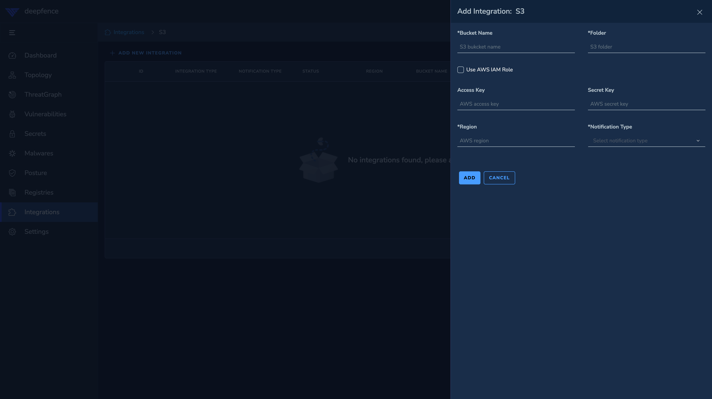

# S3

### Archiving to S3

Archive selected resources to your AWS S3 bucket into selected folder [format of the file will be .json]

1. Type your S3 bucket name (bucket should be created before this)
2. Set S3 folder name that will be created inside the bucket if not present
3. Provide your access key and secret access key provided by amazon
4. Select region
5. Choose resources
6. Click Add button 
