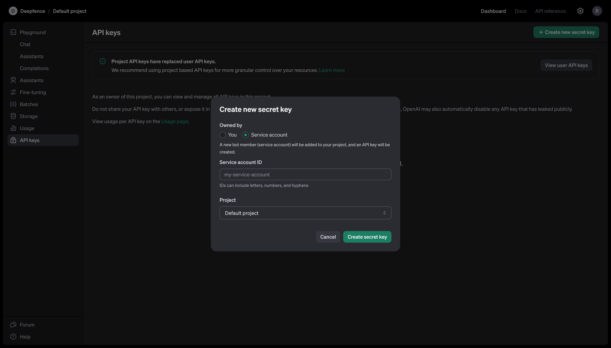
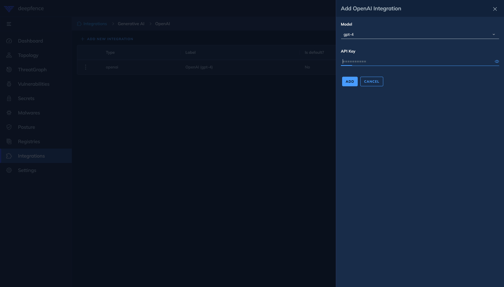
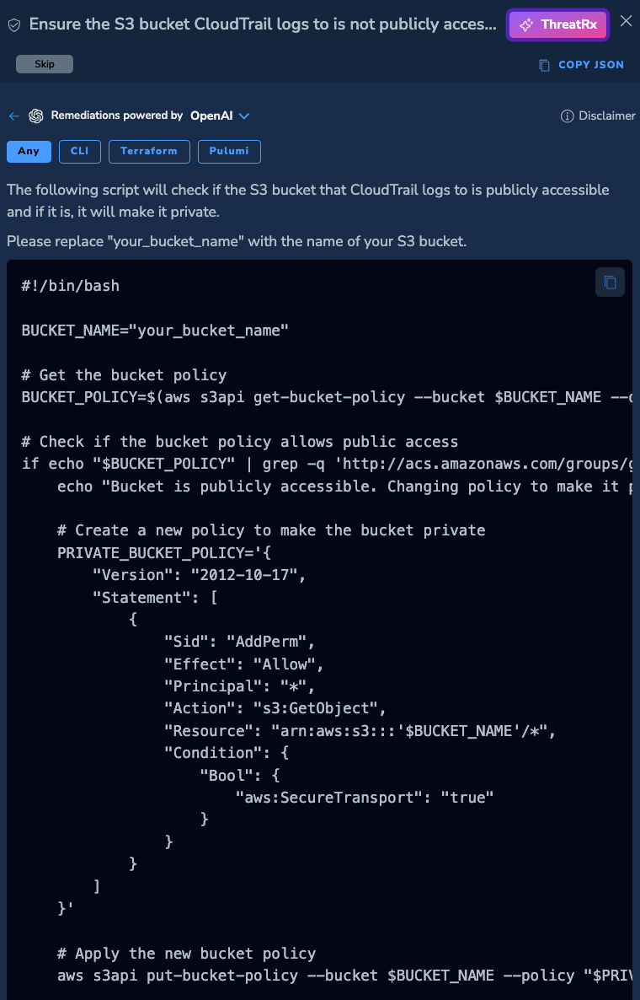
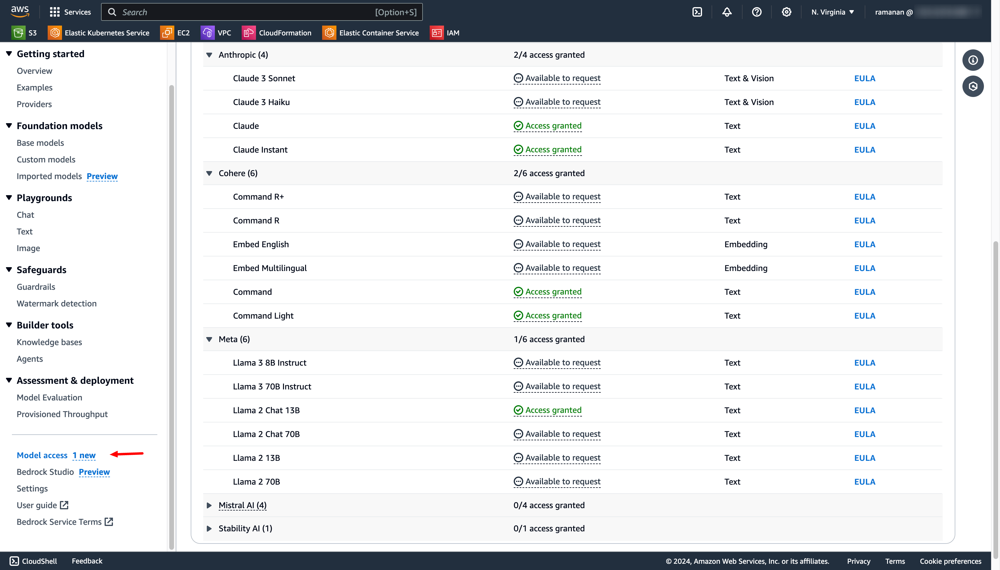
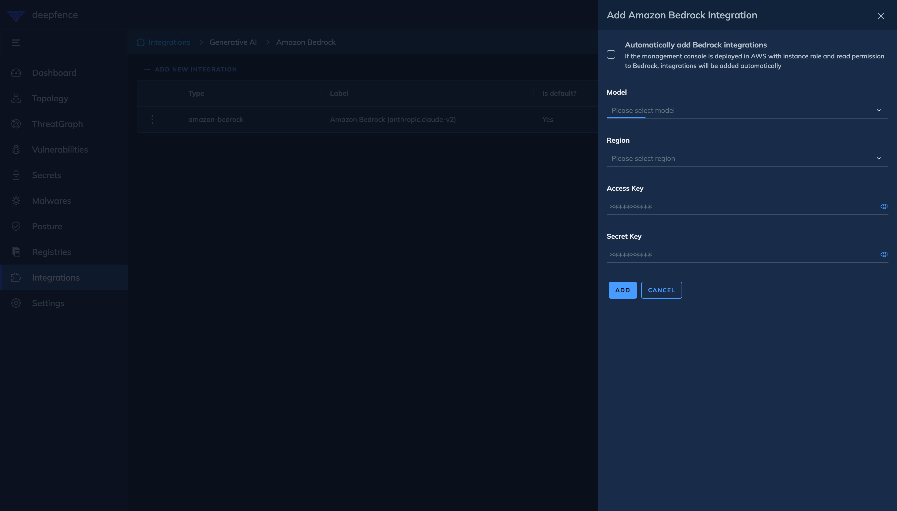

# ThreatRx

ThreatRx is LLM-assisted remediation for cloud misconfigurations (CSPM scans), vulnerabilities, malwares and secrets.

Following LLM integrations are available:
- OpenAI
- Amazon Bedrock

For more details, please visit Deepfence blog here:
- https://www.deepfence.io/blog/deepfence-revolutionizes-cloud-security-with-ai-powered-remediation-introducing-threatrx-part-1
- https://www.deepfence.io/blog/deepfence-revolutionizes-cloud-security-with-ai-powered-remediation-introducing-threatrx-part-2

## To Configure OpenAI

1. Create an API key here: https://platform.openai.com/api-keys

   

2. In the integrations page, select **ThreatRx** and click **OpenAI** to create a new integration. Choose the OpenAI model, enter the API key and click save.

   

3. Navigate to cloud posture scan results or vulnerability scan results and click **ThreatRx** button on the scan result side panel to get the remediation steps.

   

## To Configure Amazon Bedrock

1. Enable any text/chat model in Amazon Bedrock.

   

2. In the integrations page, select **ThreatRx** and click **Amazon Bedrock** to create a new integration. Choose the Amazon Bedrock model, enter the access key and secret key and click save. Alternatively, if the console has write permission to Amazon Bedrock via instance IAM role, you can choose to add the models automatically.

   

3. Navigate to cloud posture scan results or vulnerability scan results and click **ThreatRx** button on the scan result side panel to get the remediation steps.
