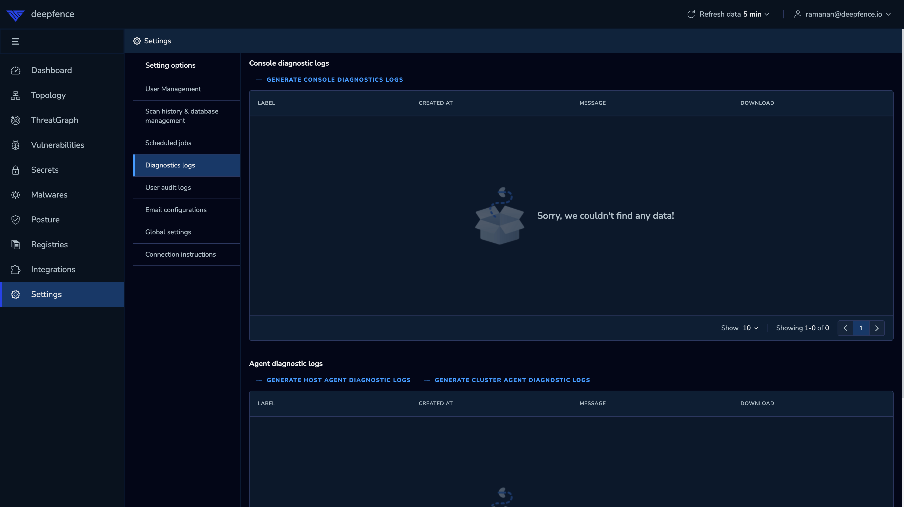

# Support and Diagnostics

## Getting Logs

You can download recent log files from the management console, and from each sensor agent on each managed host.

 * Access the Management Console
 * Go to **Settings** > **Diagnosis**
 * Download the diagnostic logs from the management console, or from a selected sensor agent instance

   

## Getting Support

Please join the [ThreatMapper community slack channel](https://join.slack.com/t/deepfence-community/shared_invite/zt-podmzle9-5X~qYx8wMaLt9bGWwkSdgQ).

## Found a bug or security issue?

For possible security issues, please refer to the [ThreatMapper Security policy](https://github.com/deepfence/ThreatMapper/blob/main/SECURITY.md).

For bug reports, contributions and roadmap suggestions, please refer to the [ThreatMapper Contributing Policy](https://github.com/deepfence/ThreatMapper/blob/main/CONTRIBUTING.md).
